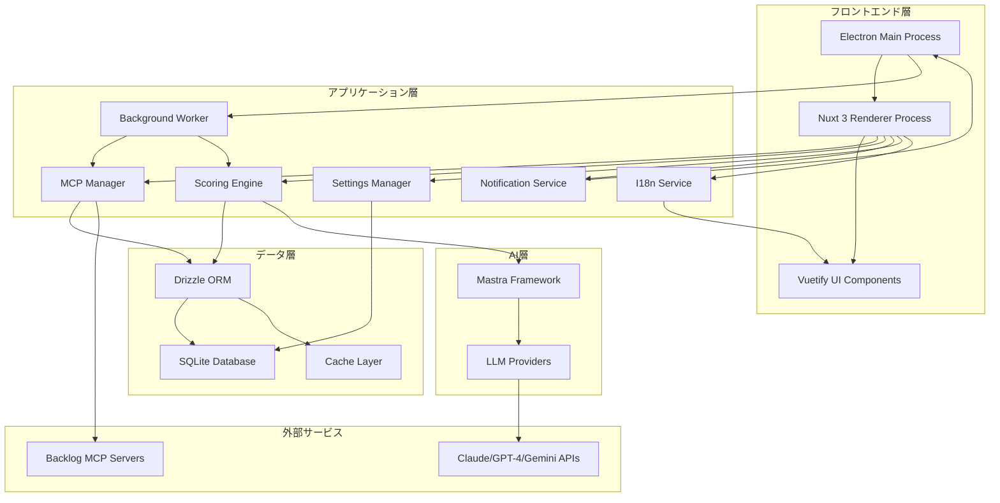
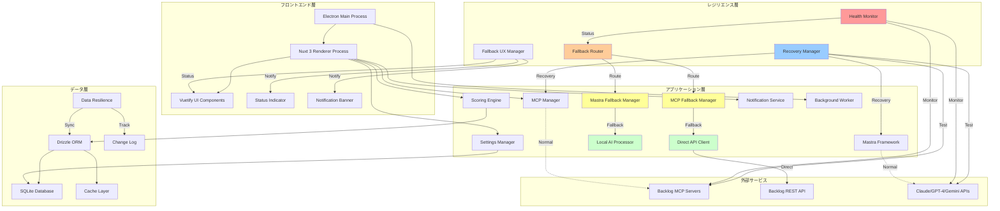
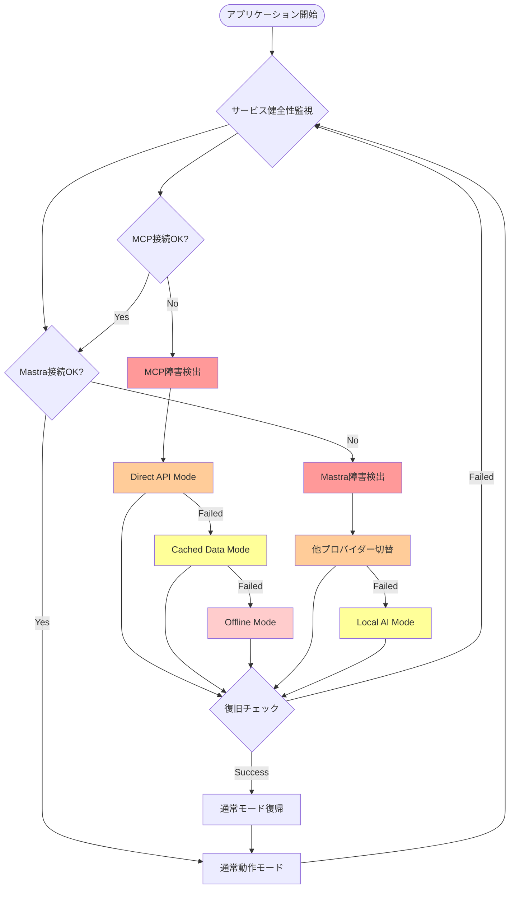
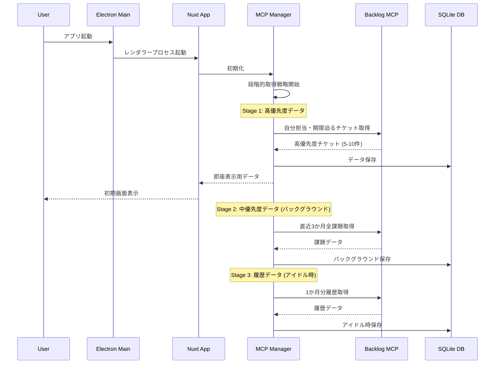
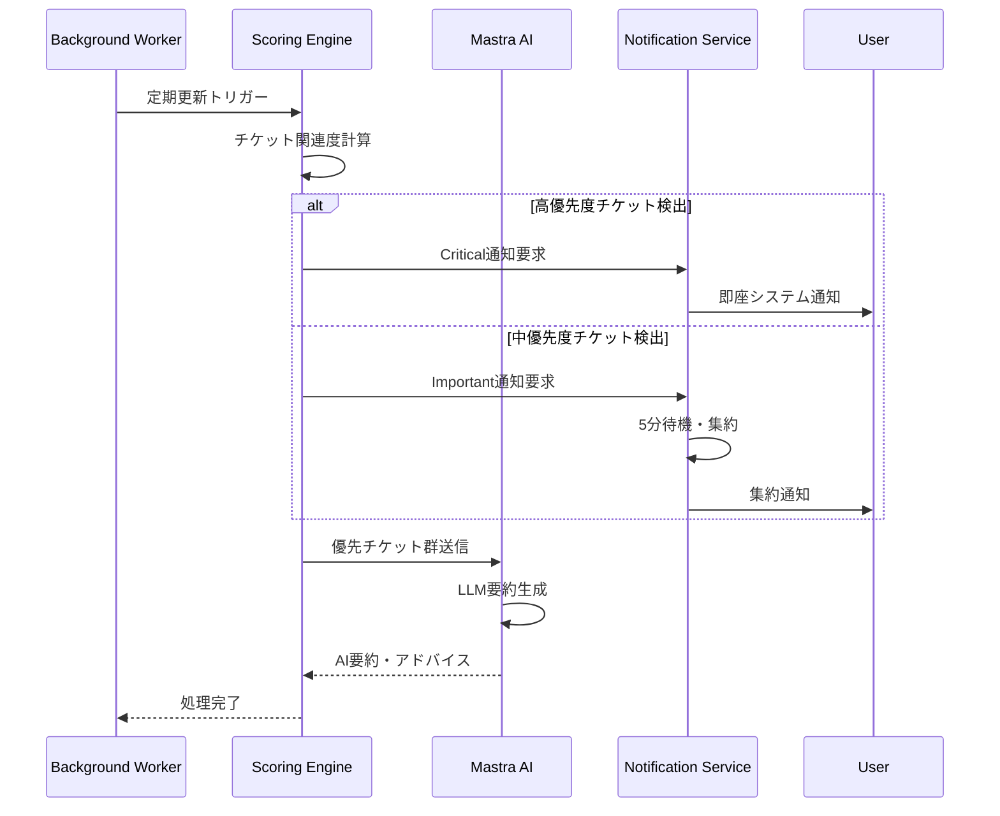
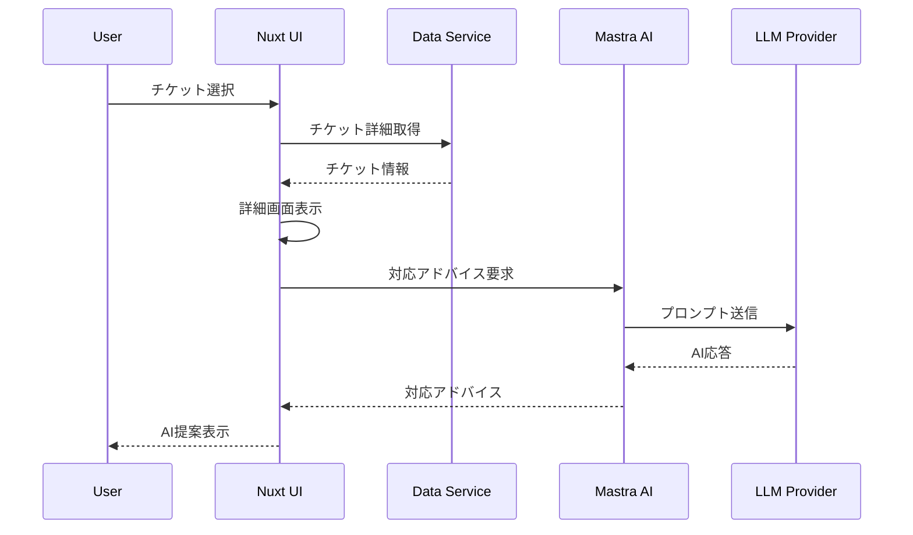
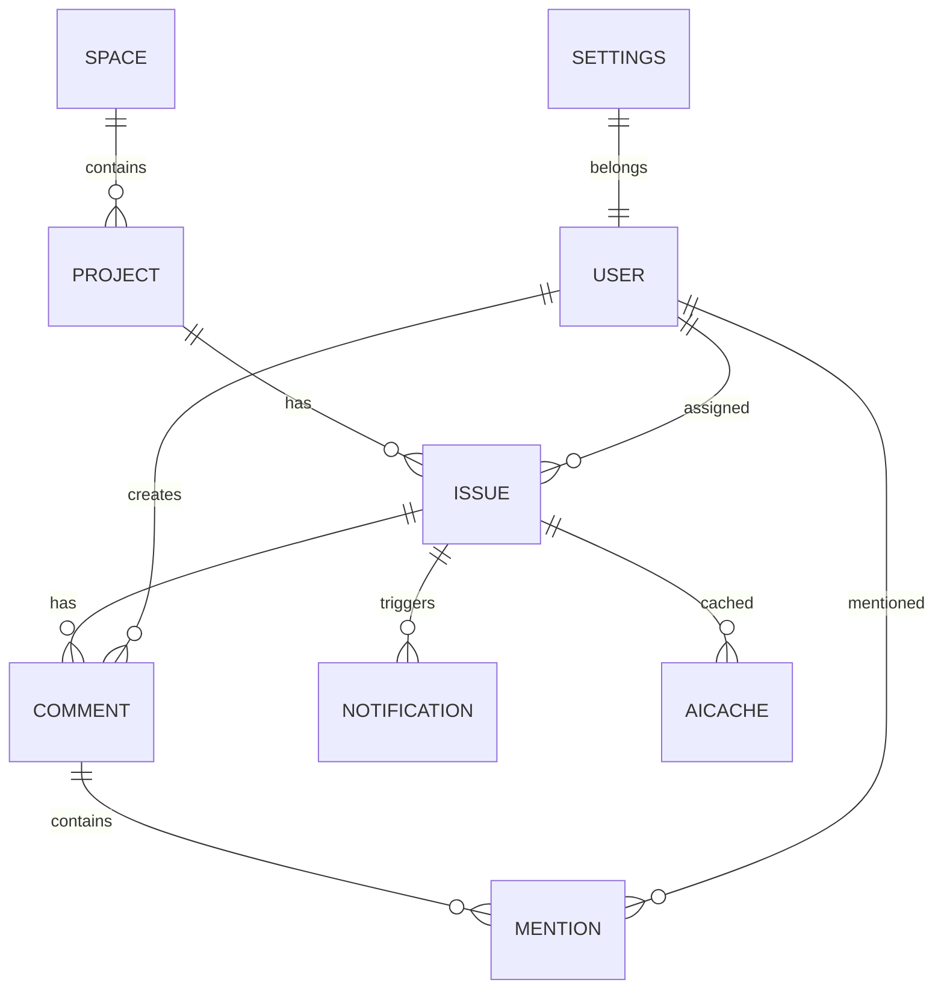
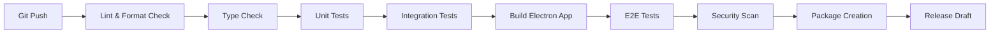
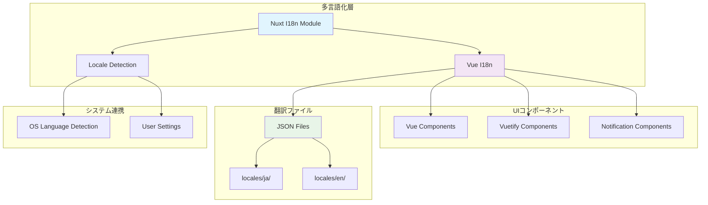

# 技術設計

## 概要

ProjectLensは、Backlog MCP Serverを活用して複数のBacklogスペースから関連度の高いチケットを自動抽出・表示・通知するデスクトップアプリケーションです。Electron + Nuxt 3 + Vuetifyの技術スタックを採用し、SQLiteによるローカルデータキャッシュとMastraフレームワーク経由でのLLM統合により、効率的なタスク管理と自動優先順位付けを実現します。

## 要件マッピング

### 設計コンポーネントのトレーサビリティ

各設計コンポーネントが対応する要件:

- **MCPマネージャー** → REQ-1: Backlog連携・データ管理システム
- **スコアリングエンジン** → REQ-2: チケット関連度スコアリングシステム
- **通知システム** → REQ-3: 通知システム
- **Mastra AI統合** → REQ-4: LLM機能・AI要約アドバイス
- **Electron/Nuxt UIレイヤー** → REQ-5: ユーザーインターフェイス
- **設定管理モジュール** → REQ-6: 設定管理システム
- **バックグラウンドワーカー** → REQ-7: バックグラウンド処理・システム常駐
- **多言語化システム** → REQ-8: 日本語・英語対応の国際化機能

### ユーザーストーリーカバレッジ

- **複数Backlogスペース管理**: MCPマネージャーによる並列接続とデータ統合
- **関連度高いチケット把握**: スコアリングエンジンによる2段階優先度システム
- **適切なタイミング通知**: 通知システムによる優先度別通知戦略
- **AI要約とアドバイス**: Mastra統合によるLLM活用
- **直感的UI操作**: Electron + Nuxt 3 + Vuetifyによるデスクトップアプリ
- **柔軟な設定管理**: SQLite + 暗号化による安全な設定保存
- **継続的監視**: バックグラウンドワーカーによる定期更新
- **多言語対応**: Vue I18nによる日本語・英語の動的切り替え

## アーキテクチャ

### 基本アーキテクチャ（通常時）



### 障害対応・フォールバック アーキテクチャ



### フォールバック戦略フロー



### 技術スタック

#### フロントエンド

- **Electron 33+**: クロスプラットフォームデスクトップアプリケーション
- **Nuxt 3.16+**: Vue 3ベースのフレームワーク、SSR無効設定
- **Vue 3.5+**: Composition APIによるリアクティブUI
- **Vuetify 3.8+**: Material Designコンポーネントライブラリ
- **TypeScript 5.7+**: 型安全性の確保
- **Pug**: HTMLテンプレートエンジン、簡潔な記法によるマークアップ効率化

#### バックエンド

- **Node.js 22+**: JavaScriptランタイム
- **@modelcontextprotocol/sdk**: MCP公式TypeScript SDK
- **@mastra/mcp**: Mastra MCP統合クライアント
- **Drizzle ORM**: TypeScript-firstの軽量ORM
- **better-sqlite3**: 高速同期SQLiteドライバー

#### ユーティリティ

- **Pino**: 構造化ログライブラリ
- **node-notifier**: クロスプラットフォーム通知
- **node-cron**: バッチ処理スケジューリング
- **@mastra/core**: AI Agentフレームワーク

#### 多言語化

- **Vue I18n**: Vue 3対応の国際化ライブラリ
- **@intlify/unplugin-vue-i18n**: Nuxt 3統合プラグイン
- **@nuxtjs/i18n**: Nuxt 3公式国際化モジュール

#### 開発・ビルド

- **nuxt-electron**: Nuxt 3とElectron統合モジュール
- **vite-plugin-electron**: Viteビルドツール統合
- **electron-builder**: アプリケーションパッケージング
- **@nuxtjs/pug**: Nuxt 3用Pugテンプレートエンジン統合モジュール
- **pug**: Pugコンパイラー本体、クリーンなHTMLテンプレート記述

### アーキテクチャ決定根拠

#### Electron + Nuxt 3選択理由

- **研究結果**: 2025年現在、nuxt-electronモジュールによる統合が成熟
- **開発効率**: HMRサポートとViteによる高速ビルド
- **メンテナンス性**: Nuxtのモジュラーアーキテクチャによる拡張性

#### Vuetify選択理由

- **Material Design準拠**: 直感的で一貫性のあるUI
- **Treeshaking対応**: 使用コンポーネントのみバンドル
- **高いカスタマイズ性**: デザイントークンシステム
- **国際化対応**: 内蔵の多言語化機能とVue I18n連携

#### SQLite + Drizzle ORM選択理由

- **ローカルファースト**: ネットワーク依存なしの高速アクセス
- **TypeScript統合**: 完全な型安全性
- **キャッシュ戦略**: Drizzleの柔軟なキャッシュ機能
- **Electron互換性**: better-sqlite3による安定動作

#### Mastra選択理由

- **MCP標準対応**: 2025年の業界標準プロトコル対応
- **マルチLLM対応**: プロバイダー切り替えが容易
- **TypeScript native**: 型安全なAI統合

#### Vue I18n選択理由

- **Vue 3完全対応**: Composition API、TypeScriptとの完全統合
- **Nuxt 3公式サポート**: @nuxtjs/i18nモジュールによるシームレス統合
- **SSR対応**: サーバーサイドレンダリング環境での正確な言語検出
- **高パフォーマンス**: 遅延読み込み、コード分割対応

#### Pugテンプレートエンジン選択理由

- **記述効率**: インデントベースの簡潔な記法によるHTML記述量削減
- **可読性向上**: ネストレベルの視覚的明確化とタグクロージャーの省略
- **Vuetifyとの親和性**: コンポーネントベースUIライブラリとの組み合わせで威力を発揮
- **TypeScript統合**: Vue SFCとの完全統合とコンポーネントpropsの型安全性
- **メンテナンス性**: 一貫した記法による長期保守性の向上
- **Nuxt 3サポート**: @nuxtjs/pugモジュールによる公式サポートとHMR対応

## データフロー

### プライマリユーザーフロー

#### 1. 初回起動とデータ取得



#### 2. スコアリングと通知



#### 3. 個別チケット詳細表示



## コンポーネントとインターフェイス

### バックエンドサービス＆メソッドシグネチャ

#### MCPManager Service（レジリエンス対応）

```typescript
class MCPManager {
  async initializeSpaces(configs: SpaceConfig[]): Promise<void>  // MCP接続初期化
  async fetchHighPriorityIssues(spaceId: string): Promise<Issue[]>  // 高優先度チケット取得
  async fetchAllIssues(spaceId: string, since?: Date): Promise<Issue[]>  // 全チケット取得
  async fetchComments(issueId: string): Promise<Comment[]>  // コメント取得
  async getUnifiedTools(): Promise<MCPTool[]>  // 統合ツール取得
  
  // レジリエンス機能
  async healthCheck(): Promise<ServiceHealth>  // 接続健全性チェック
  async reconnectAll(): Promise<void>  // 全接続再試行
  async reloadConfiguration(): Promise<void>  // 設定再読み込み
  getCurrentStrategy(): FallbackStrategy  // 現在の動作モード
  async switchToFallbackMode(mode: FallbackMode): Promise<void>  // フォールバックモード切替
}

class MCPFallbackManager {
  async handleMCPFailure(error: MCPError): Promise<void>  // MCP障害ハンドリング
  async initializeDirectBacklogAPI(): Promise<void>  // 直接API初期化
  async enableCachedDataMode(): Promise<void>  // キャッシュモード有効化
  async enterOfflineMode(): Promise<void>  // オフラインモード移行
  async restoreNormalOperation(): Promise<void>  // 通常動作復帰
}

class BacklogDirectClient {
  constructor(config: DirectAPIConfig)
  async validate(): Promise<void>  // API接続検証
  async getIssues(projectId: string): Promise<Issue[]>  // チケット取得
  async getComments(issueId: string): Promise<Comment[]>  // コメント取得
  async updateIssue(issueId: string, data: Partial<Issue>): Promise<Issue>  // チケット更新
}
```

#### ScoringEngine Service

```typescript
class ScoringEngine {
  calculateScore(issue: Issue, context: UserContext): number  // スコア計算
  classifyPriority(score: number): Priority  // 優先度分類
  async analyzeComments(issue: Issue): Promise<CommentAnalysis>  // コメント分析
  async detectMentions(comments: Comment[]): Promise<Mention[]>  // メンション検出
  applyCustomWeights(config: ScoringConfig): void  // カスタム重み適用
}
```

#### NotificationService

```typescript
class NotificationService {
  async sendCriticalNotification(issues: Issue[]): Promise<void>  // 高優先度通知
  async queueImportantNotification(issues: Issue[]): Promise<void>  // 中優先度通知キュー
  async processBatchNotifications(): Promise<void>  // バッチ通知処理
  registerClickHandler(callback: () => void): void  // クリックハンドラー登録
}
```

#### MastraAIService（レジリエンス対応）

```typescript
class MastraAIService {
  async generateSummary(issues: Issue[]): Promise<Summary>  // チケット群要約
  async generateAdvice(issue: Issue): Promise<Advice>  // 個別アドバイス
  async suggestNextActions(issue: Issue): Promise<Action[]>  // 次のアクション提案
  switchProvider(provider: LLMProvider): void  // プロバイダー切り替え
  
  // レジリエンス機能
  async testProvider(provider: LLMProvider, prompt: string): Promise<void>  // プロバイダーテスト
  async validateProviders(): Promise<LLMProvider[]>  // 利用可能プロバイダー検証
  async restart(): Promise<void>  // サービス再起動
  isLocalModeEnabled(): boolean  // ローカルモード状態確認
}

class MastraFallbackManager {
  async handleMastraFailure(error: MastraError): Promise<void>  // Mastra障害ハンドリング
  async switchToNextProvider(): Promise<void>  // 次プロバイダーへ切替
  async enableLocalAIFallback(): Promise<void>  // ローカルAI有効化
  async retryCurrentProvider(): Promise<void>  // 現在プロバイダーリトライ
}

class LocalAIProcessor {
  enableRuleBasedSummary(config: RuleConfig): void  // ルールベース要約有効化
  enableTemplateAdvice(config: TemplateConfig): void  // テンプレートアドバイス有効化
  async processSummary(issues: Issue[]): Promise<Summary>  // ローカル要約処理
  async processAdvice(issue: Issue): Promise<Advice>  // ローカルアドバイス処理
  async loadAdviceTemplates(): Promise<AdviceTemplate[]>  // アドバイステンプレート読込
}
```

### フロントエンドコンポーネント

| コンポーネント名 | 責任 | Props/State概要 |
|--------------|-----|---------------|
| MainWindow | メインウィンドウ管理 | windowState, trayVisible |
| IssueList | チケットリスト表示 | issues[], sortOrder, filters |
| IssueCard | 個別チケットカード | issue, priority, score |
| IssueDetail | チケット詳細画面 | issue, comments, advice |
| AISummaryPanel | AI要約パネル | summary, loading, error |
| SettingsDialog | 設定ダイアログ | settings, spaces[], providers[] |
| NotificationToast | 通知トースト | message, type, duration |
| SystemTrayMenu | システムトレイメニュー | updateCount, menuItems[] |
| DashboardStats | ダッシュボード統計 | stats, period |
| SearchBar | 検索バー | query, filters, suggestions[] |
| LanguageSelector | 言語切り替え | currentLocale, availableLocales |

### Pugテンプレートを使ったコンポーネント実装

#### IssueCard コンポーネント（Pug実装例）

```vue
<template lang="pug">
v-card.issue-card(
  :color="priorityColor"
  :elevation="score > 80 ? 4 : 2"
  @click="$emit('select', issue)"
  hover
)
  v-card-title.d-flex.justify-space-between.align-center
    .issue-title {{ issue.summary }}
    v-chip(
      :color="getPriorityChipColor(issue.priorityId)"
      size="small"
      label
    ) {{ getPriorityText(issue.priorityId) }}
  
  v-card-subtitle.d-flex.align-center.py-1
    v-icon.me-2(size="small") mdi-ticket-outline
    span.text-caption {{ issue.key }}
    v-spacer
    span.text-caption {{ formatDate(issue.updated) }}
  
  v-card-text
    .issue-description.text-body-2.mb-3(
      v-if="issue.description"
    ) {{ truncateText(issue.description, 120) }}
    
    .issue-meta.d-flex.flex-wrap.ga-2
      v-chip(
        v-if="issue.assigneeName"
        size="x-small"
        prepend-icon="mdi-account"
        variant="outlined"
      ) {{ issue.assigneeName }}
      
      v-chip(
        v-if="issue.dueDate"
        size="x-small"
        prepend-icon="mdi-calendar"
        :color="getDueDateColor(issue.dueDate)"
      ) {{ formatDate(issue.dueDate) }}
      
      v-chip(
        size="x-small"
        prepend-icon="mdi-chart-line"
        color="primary"
      ) スコア: {{ score }}
  
  v-card-actions.pt-0
    v-btn(
      size="small"
      variant="text"
      prepend-icon="mdi-open-in-new"
      @click.stop="openInBacklog"
    ) Backlogで開く
    v-spacer
    v-btn(
      size="small"
      variant="text"
      prepend-icon="mdi-robot"
      @click.stop="$emit('generate-summary')"
      :loading="summaryLoading"
    ) AI要約
</template>

<script setup lang="ts">
import type { Issue } from '~/types/issue'

interface Props {
  issue: Issue
  score: number
  summaryLoading?: boolean
}

interface Emits {
  select: [issue: Issue]
  'generate-summary': []
}

defineProps<Props>()
defineEmits<Emits>()

// コンポーネントロジック
const priorityColor = computed(() => {
  if (props.score > 90) return 'error'
  if (props.score > 70) return 'warning'
  return 'surface'
})

const getPriorityChipColor = (priorityId: number): string => {
  const colors = { 2: 'error', 3: 'warning', 4: 'info' }
  return colors[priorityId] || 'default'
}

const getPriorityText = (priorityId: number): string => {
  const { t } = useI18n()
  const priorities = {
    2: t('priority.high'),
    3: t('priority.normal'),
    4: t('priority.low')
  }
  return priorities[priorityId] || t('priority.unknown')
}

const truncateText = (text: string, length: number): string => {
  return text.length > length ? text.substring(0, length) + '...' : text
}

const formatDate = (date: Date): string => {
  return new Intl.DateTimeFormat('ja-JP', {
    month: 'short',
    day: 'numeric'
  }).format(date)
}

const getDueDateColor = (dueDate: Date): string => {
  const today = new Date()
  const diffDays = Math.ceil((dueDate.getTime() - today.getTime()) / (1000 * 60 * 60 * 24))
  
  if (diffDays < 0) return 'error' // 期限切れ
  if (diffDays <= 3) return 'warning' // 3日以内
  return 'info'
}

const openInBacklog = () => {
  if (window.electronAPI) {
    window.electronAPI.openExternal(`https://example.backlog.jp/view/${props.issue.key}`)
  }
}
</script>

<style scoped>
.issue-card {
  transition: transform 0.2s ease-in-out;
}

.issue-card:hover {
  transform: translateY(-2px);
}

.issue-description {
  line-height: 1.4;
}
</style>
```

#### SettingsDialog コンポーネント（Pug実装例）

```vue
<template lang="pug">
v-dialog(
  v-model="dialog"
  max-width="800"
  persistent
)
  v-card
    v-card-title.d-flex.align-center.bg-primary
      v-icon.me-3 mdi-cog
      span {{ $t('settings.title') }}
      v-spacer
      v-btn(
        icon
        variant="text"
        @click="dialog = false"
      )
        v-icon mdi-close
    
    v-card-text.pa-0
      v-tabs(
        v-model="activeTab"
        bg-color="surface"
      )
        v-tab(
          value="general"
          prepend-icon="mdi-cog"
        ) {{ $t('settings.tabs.general') }}
        
        v-tab(
          value="spaces"
          prepend-icon="mdi-domain"
        ) {{ $t('settings.tabs.spaces') }}
        
        v-tab(
          value="notifications"
          prepend-icon="mdi-bell"
        ) {{ $t('settings.tabs.notifications') }}
        
        v-tab(
          value="ai"
          prepend-icon="mdi-robot"
        ) {{ $t('settings.tabs.ai') }}
      
      v-window(
        v-model="activeTab"
        class="settings-window"
      )
        v-window-item(value="general")
          .pa-6
            v-row
              v-col(cols="12")
                h3.text-h6.mb-4 {{ $t('settings.general.title') }}
              
              v-col(cols="12" md="6")
                language-selector(
                  v-model="settings.language"
                  :label="$t('settings.general.language')"
                )
              
              v-col(cols="12" md="6")
                v-select(
                  v-model="settings.theme"
                  :items="themeOptions"
                  :label="$t('settings.general.theme')"
                  prepend-icon="mdi-palette"
                )
              
              v-col(cols="12")
                v-switch(
                  v-model="settings.startupLaunch"
                  :label="$t('settings.general.startup')"
                  color="primary"
                )
              
              v-col(cols="12")
                v-switch(
                  v-model="settings.minimizeToTray"
                  :label="$t('settings.general.tray')"
                  color="primary"
                )
        
        v-window-item(value="spaces")
          .pa-6
            .d-flex.justify-space-between.align-center.mb-4
              h3.text-h6 {{ $t('settings.spaces.title') }}
              v-btn(
                color="primary"
                prepend-icon="mdi-plus"
                @click="addSpace"
              ) {{ $t('settings.spaces.add') }}
            
            v-list(v-if="spaces.length > 0")
              v-list-item(
                v-for="(space, index) in spaces"
                :key="space.id"
                class="space-item"
              )
                template(#prepend)
                  v-avatar(color="primary")
                    v-icon mdi-domain
                
                v-list-item-title {{ space.name }}
                v-list-item-subtitle {{ space.spaceKey }}.backlog.jp
                
                template(#append)
                  v-btn(
                    icon
                    size="small"
                    variant="text"
                    @click="editSpace(space)"
                  )
                    v-icon mdi-pencil
                  v-btn(
                    icon
                    size="small"
                    variant="text"
                    color="error"
                    @click="deleteSpace(index)"
                  )
                    v-icon mdi-delete
            
            v-empty-state(
              v-else
              icon="mdi-domain-off"
              :title="$t('settings.spaces.empty.title')"
              :text="$t('settings.spaces.empty.description')"
            )
              template(#actions)
                v-btn(
                  color="primary"
                  prepend-icon="mdi-plus"
                  @click="addSpace"
                ) {{ $t('settings.spaces.add') }}
        
        v-window-item(value="notifications")
          .pa-6
            h3.text-h6.mb-4 {{ $t('settings.notifications.title') }}
            
            v-row
              v-col(cols="12")
                v-switch(
                  v-model="settings.notifications.enabled"
                  :label="$t('settings.notifications.enable')"
                  color="primary"
                )
              
              v-col(cols="12" md="6")
                v-select(
                  v-model="settings.notifications.priority"
                  :items="priorityOptions"
                  :label="$t('settings.notifications.priority')"
                  :disabled="!settings.notifications.enabled"
                )
              
              v-col(cols="12" md="6")
                v-text-field(
                  v-model.number="settings.notifications.interval"
                  type="number"
                  :label="$t('settings.notifications.interval')"
                  suffix="分"
                  :disabled="!settings.notifications.enabled"
                )
    
    v-card-actions.pa-6
      v-spacer
      v-btn(
        variant="text"
        @click="dialog = false"
      ) {{ $t('common.cancel') }}
      v-btn(
        color="primary"
        @click="saveSettings"
        :loading="saving"
      ) {{ $t('common.save') }}
</template>

<script setup lang="ts">
import type { Settings, BacklogSpace } from '~/types/settings'

interface Props {
  modelValue: boolean
  settings: Settings
  spaces: BacklogSpace[]
}

interface Emits {
  'update:modelValue': [value: boolean]
  'save': [settings: Settings]
  'add-space': []
  'edit-space': [space: BacklogSpace]
  'delete-space': [index: number]
}

const props = defineProps<Props>()
const emit = defineEmits<Emits>()

const dialog = computed({
  get: () => props.modelValue,
  set: (value: boolean) => emit('update:modelValue', value)
})

const activeTab = ref('general')
const saving = ref(false)

const { t } = useI18n()

const themeOptions = computed(() => [
  { title: t('settings.theme.auto'), value: 'auto' },
  { title: t('settings.theme.light'), value: 'light' },
  { title: t('settings.theme.dark'), value: 'dark' }
])

const priorityOptions = computed(() => [
  { title: t('priority.high'), value: 'high' },
  { title: t('priority.normal'), value: 'normal' },
  { title: t('priority.low'), value: 'low' }
])

const saveSettings = async () => {
  saving.value = true
  try {
    emit('save', props.settings)
    dialog.value = false
  } finally {
    saving.value = false
  }
}

const addSpace = () => {
  emit('add-space')
}

const editSpace = (space: BacklogSpace) => {
  emit('edit-space', space)
}

const deleteSpace = (index: number) => {
  emit('delete-space', index)
}
</script>

<style scoped>
.settings-window {
  min-height: 400px;
}

.space-item {
  border-bottom: 1px solid rgb(var(--v-theme-outline-variant));
}

.space-item:last-child {
  border-bottom: none;
}
</style>
```

### APIエンドポイント

| メソッド | ルート | 目的 | 認証 | ステータスコード |
|---------|--------|-----|------|-----------------|
| GET | /api/issues | チケット一覧取得 | 不要 | 200, 500 |
| GET | /api/issues/:id | チケット詳細取得 | 不要 | 200, 404, 500 |
| POST | /api/issues/sync | 同期実行 | 不要 | 201, 400, 500 |
| GET | /api/spaces | スペース一覧取得 | 不要 | 200, 500 |
| POST | /api/spaces | スペース追加 | 不要 | 201, 400, 500 |
| PUT | /api/spaces/:id | スペース更新 | 不要 | 200, 400, 404, 500 |
| DELETE | /api/spaces/:id | スペース削除 | 不要 | 204, 404, 500 |
| GET | /api/settings | 設定取得 | 不要 | 200, 500 |
| PUT | /api/settings | 設定更新 | 不要 | 200, 400, 500 |
| POST | /api/ai/summary | AI要約生成 | 不要 | 200, 400, 500 |
| POST | /api/ai/advice | AIアドバイス生成 | 不要 | 200, 400, 500 |

### Pugテンプレートエンジンプロジェクト設定

#### package.json 依存関係設定

```json
{
  "name": "project-lens",
  "version": "1.0.0",
  "description": "Backlog MCPサーバーを活用したProjectLensデスクトップアプリケーション",
  "main": "./dist-electron/main.js",
  "scripts": {
    "dev": "nuxt dev",
    "build": "nuxt build",
    "dev:electron": "nuxt build && electron .",
    "build:electron": "nuxt build && electron-builder",
    "preview": "nuxt preview",
    "postinstall": "nuxt prepare",
    "type-check": "vue-tsc --noEmit"
  },
  "dependencies": {
    "@nuxt/electron": "^0.7.0",
    "@nuxtjs/i18n": "^8.5.5",
    "@nuxtjs/pug": "^1.0.3",
    "@modelcontextprotocol/sdk": "^1.0.0",
    "@mastra/mcp": "^1.0.0",
    "@mastra/core": "^1.0.0",
    "better-sqlite3": "^11.5.0",
    "drizzle-orm": "^0.36.0",
    "electron": "^33.2.0",
    "node-cron": "^3.0.3",
    "node-notifier": "^10.0.1",
    "nuxt": "^3.16.0",
    "pino": "^9.7.0",
    "pug": "^3.0.3",
    "vue": "^3.5.0",
    "vuetify": "^3.8.0"
  },
  "devDependencies": {
    "@types/better-sqlite3": "^7.6.11",
    "@types/node": "^22.10.1",
    "@types/node-cron": "^3.0.11",
    "@types/pug": "^2.0.10",
    "drizzle-kit": "^0.28.0",
    "electron-builder": "^25.1.8",
    "typescript": "^5.7.0",
    "vite-plugin-electron": "^0.28.8",
    "vue-tsc": "^2.1.10"
  },
  "build": {
    "appId": "com.projectlens.desktop",
    "productName": "ProjectLens",
    "directories": {
      "output": "dist-app"
    },
    "files": [
      "dist/**/*",
      "dist-electron/**/*",
      "node_modules/**/*",
      "package.json"
    ],
    "mac": {
      "icon": "build/icon.icns",
      "category": "public.app-category.productivity"
    },
    "win": {
      "icon": "build/icon.ico"
    },
    "linux": {
      "icon": "build/icon.png"
    }
  }
}
```

#### プロジェクトディレクトリ構成

```
project-lens/
├── components/          # Vueコンポーネント (.vue with Pug template)
│   ├── Issue/
│   │   ├── IssueCard.vue      # Pugテンプレート使用
│   │   ├── IssueList.vue      # Pugテンプレート使用
│   │   └── IssueDetail.vue    # Pugテンプレート使用
│   ├── Settings/
│   │   ├── SettingsDialog.vue # Pugテンプレート使用
│   │   └── LanguageSelector.vue # Pugテンプレート使用
│   ├── AI/
│   │   └── AISummaryPanel.vue # Pugテンプレート使用
│   └── Common/
│       ├── MainWindow.vue     # Pugテンプレート使用
│       └── NotificationToast.vue # Pugテンプレート使用
├── pages/               # Nuxtページ (.vue with Pug template)
│   ├── index.vue           # メインダッシュボード (Pug)
│   └── settings.vue        # 設定ページ (Pug)
├── layouts/             # レイアウト (.vue with Pug template)
│   └── default.vue         # デフォルトレイアウト (Pug)
├── electron/
│   ├── main.ts             # Electronメインプロセス
│   └── preload.ts          # プリロードスクリプト
├── services/            # サービスクラス
├── types/               # TypeScript型定義
├── locales/             # 多言語ファイル
├── nuxt.config.ts       # Pug設定含むNuxt設定
└── package.json         # 依存関係設定
```

#### Pugテンプレートベストプラクティス

##### 1. インデント統一
```pug
// 推奨: 2スペースインデント
v-container
  v-row
    v-col(cols="12")
      h1 ProjectLens Dashboard
```

##### 2. Vuetifyコンポーネントとの組み合わせ
```pug
// 属性の縦列化（可読性向上）
v-card.elevation-2(
  :loading="loading"
  :color="cardColor"
  @click="handleClick"
)
  v-card-title {{ title }}
  v-card-text
    p {{ description }}
```

##### 3. 条件分岐とループ
```pug
// v-if, v-forの使用
v-list
  v-list-item(
    v-for="issue in issues"
    :key="issue.id"
    v-if="issue.visible"
  )
    v-list-item-title {{ issue.summary }}
    v-list-item-subtitle {{ issue.description }}
```

##### 4. コンポーネント再使用
```pug
// include機能でパーシャルを再使用
template
  .dashboard
    include ./partials/header.pug
    .main-content
      issue-list(:issues="filteredIssues")
    include ./partials/footer.pug
```

##### 5. TypeScript統合
```vue
<template lang="pug">
v-card(:title="computedTitle")
  v-card-text {{ formattedData }}
</template>

<script setup lang="ts">
interface Props {
  title: string
  data: any
}

const props = defineProps<Props>()

const computedTitle = computed(() => 
  props.title.toUpperCase()
)

const formattedData = computed(() => 
  JSON.stringify(props.data, null, 2)
)
</script>
```

### フォールバック戦略実装例

#### 健全性監視サービス実装

```typescript
// types/fallback.ts
export interface ServiceHealth {
  service: 'mcp' | 'mastra' | 'backlog' | 'llm';
  status: 'healthy' | 'degraded' | 'critical' | 'offline';
  lastCheck: Date;
  responseTime: number;
  errorCount: number;
  uptime: number;
  lastError?: string;
}

export interface FallbackStrategy {
  name: string;
  priority: number;
  canHandle: (error: Error) => boolean;
  execute: () => Promise<void>;
  rollback: () => Promise<void>;
}

// services/healthMonitor.ts
export class HealthMonitor {
  private services = new Map<string, ServiceHealth>();
  private listeners: Array<(health: ServiceHealth) => void> = [];
  private checkInterval = 30000; // 30秒

  constructor(
    private mcpManager: MCPManager,
    private mastraService: MastraAIService,
    private logger: Logger
  ) {}

  async startMonitoring(): Promise<void> {
    await this.runHealthChecks();
    
    setInterval(async () => {
      await this.runHealthChecks();
    }, this.checkInterval);
  }

  private async runHealthChecks(): Promise<void> {
    const checks = [
      this.checkMCPHealth(),
      this.checkMastraHealth(),
    ];

    await Promise.allSettled(checks);
    this.notifyListeners();
  }

  private async checkMCPHealth(): Promise<void> {
    const startTime = Date.now();
    const serviceName = 'mcp';
    
    try {
      await this.mcpManager.healthCheck();
      const responseTime = Date.now() - startTime;
      
      this.services.set(serviceName, {
        service: serviceName,
        status: this.classifyStatus(responseTime, 0),
        lastCheck: new Date(),
        responseTime,
        errorCount: 0,
        uptime: this.calculateUptime(serviceName),
      });
      
    } catch (error) {
      const currentHealth = this.services.get(serviceName);
      const errorCount = (currentHealth?.errorCount || 0) + 1;
      
      this.services.set(serviceName, {
        service: serviceName,
        status: 'offline',
        lastCheck: new Date(),
        responseTime: Date.now() - startTime,
        errorCount,
        uptime: this.calculateUptime(serviceName),
        lastError: error.message,
      });
    }
  }

  public getFailedServices(): string[] {
    return Array.from(this.services.entries())
      .filter(([_, health]) => health.status === 'offline' || health.status === 'critical')
      .map(([service]) => service);
  }

  public onHealthChange(callback: (health: ServiceHealth) => void): void {
    this.listeners.push(callback);
  }

  private classifyStatus(responseTime: number, errorCount: number): ServiceHealth['status'] {
    if (errorCount > 5) return 'offline';
    if (responseTime > 5000) return 'critical';
    if (responseTime > 1000) return 'degraded';
    return 'healthy';
  }

  private calculateUptime(serviceName: string): number {
    const health = this.services.get(serviceName);
    if (!health) return 100;
    
    const totalChecks = Math.max(health.errorCount + 1, 1);
    const successfulChecks = totalChecks - health.errorCount;
    return (successfulChecks / totalChecks) * 100;
  }

  private notifyListeners(): void {
    for (const [_, health] of this.services) {
      this.listeners.forEach(callback => callback(health));
    }
  }
}
```

#### 直接APIクライアント実装

```typescript
// services/backlogDirectClient.ts
export class BacklogDirectClient {
  private readonly baseUrl: string;
  private readonly apiKey: string;
  private readonly rateLimiter: RateLimiter;

  constructor(config: DirectAPIConfig) {
    this.baseUrl = `https://${config.spaceKey}.backlog.jp/api/v2`;
    this.apiKey = config.apiKey;
    this.rateLimiter = new RateLimiter({ rpm: config.rateLimitRpm || 150 });
  }

  async validate(): Promise<void> {
    try {
      await this.rateLimiter.execute(() => 
        fetch(`${this.baseUrl}/users/myself?apiKey=${this.apiKey}`)
      );
    } catch (error) {
      throw new DirectAPIError(`Validation failed: ${error.message}`);
    }
  }

  async getIssues(projectId: string, options?: GetIssuesOptions): Promise<Issue[]> {
    const params = new URLSearchParams({
      apiKey: this.apiKey,
      'projectId[]': projectId,
      ...this.buildQueryParams(options),
    });

    const response = await this.rateLimiter.execute(() => 
      fetch(`${this.baseUrl}/issues?${params}`)
    );

    if (!response.ok) {
      throw new DirectAPIError(`Failed to fetch issues: ${response.statusText}`);
    }

    const data = await response.json();
    return data.map(this.mapBacklogIssueToInternal);
  }

  async getComments(issueId: string): Promise<Comment[]> {
    const response = await this.rateLimiter.execute(() => 
      fetch(`${this.baseUrl}/issues/${issueId}/comments?apiKey=${this.apiKey}`)
    );

    if (!response.ok) {
      throw new DirectAPIError(`Failed to fetch comments: ${response.statusText}`);
    }

    const data = await response.json();
    return data.map(this.mapBacklogCommentToInternal);
  }

  private mapBacklogIssueToInternal(backlogIssue: any): Issue {
    return {
      id: `backlog-${backlogIssue.id}`,
      spaceId: backlogIssue.projectId.toString(),
      projectId: backlogIssue.projectId,
      backlogIssueId: backlogIssue.id,
      key: backlogIssue.issueKey,
      summary: backlogIssue.summary,
      description: backlogIssue.description,
      statusId: backlogIssue.status.id,
      priorityId: backlogIssue.priority.id,
      assigneeId: backlogIssue.assignee?.id,
      dueDate: backlogIssue.dueDate ? new Date(backlogIssue.dueDate) : undefined,
      created: new Date(backlogIssue.created),
      updated: new Date(backlogIssue.updated),
    };
  }

  private buildQueryParams(options?: GetIssuesOptions): Record<string, string> {
    const params: Record<string, string> = {};
    
    if (options?.assigneeId) {
      params['assigneeId[]'] = options.assigneeId.toString();
    }
    if (options?.statusId) {
      params['statusId[]'] = options.statusId.toString();
    }
    if (options?.since) {
      params.since = options.since.toISOString();
    }
    
    return params;
  }
}

// レートリミッター実装
class RateLimiter {
  private requests: number[] = [];
  private readonly maxRequests: number;
  private readonly timeWindow: number;

  constructor(config: { rpm: number }) {
    this.maxRequests = config.rpm;
    this.timeWindow = 60000; // 1分
  }

  async execute<T>(fn: () => Promise<T>): Promise<T> {
    await this.waitIfNeeded();
    
    try {
      const result = await fn();
      this.recordRequest();
      return result;
    } catch (error) {
      this.recordRequest(); // 失敗したリクエストもカウント
      throw error;
    }
  }

  private async waitIfNeeded(): Promise<void> {
    this.cleanOldRequests();
    
    if (this.requests.length >= this.maxRequests) {
      const oldestRequest = this.requests[0];
      const waitTime = this.timeWindow - (Date.now() - oldestRequest);
      
      if (waitTime > 0) {
        await new Promise(resolve => setTimeout(resolve, waitTime));
      }
    }
  }

  private recordRequest(): void {
    this.requests.push(Date.now());
    this.cleanOldRequests();
  }

  private cleanOldRequests(): void {
    const cutoff = Date.now() - this.timeWindow;
    this.requests = this.requests.filter(time => time > cutoff);
  }
}
```

#### ローカルAIプロセッサー実装

```typescript
// services/localAIProcessor.ts
export class LocalAIProcessor {
  private ruleConfig: RuleConfig | null = null;
  private templateConfig: TemplateConfig | null = null;
  private adviceTemplates: AdviceTemplate[] = [];

  enableRuleBasedSummary(config: RuleConfig): void {
    this.ruleConfig = config;
  }

  enableTemplateAdvice(config: TemplateConfig): void {
    this.templateConfig = config;
    this.loadAdviceTemplates();
  }

  async processSummary(issues: Issue[]): Promise<Summary> {
    if (!this.ruleConfig) {
      throw new Error('Rule-based summary not enabled');
    }

    // 優先度分析
    const priorityAnalysis = this.analyzePriority(issues);
    const statusAnalysis = this.analyzeStatus(issues);
    const urgencyAnalysis = this.analyzeUrgency(issues);

    // サマリー生成
    const summary = {
      type: 'rule-based' as const,
      content: this.generateSummaryText(priorityAnalysis, statusAnalysis, urgencyAnalysis),
      metadata: {
        totalIssues: issues.length,
        criticalCount: priorityAnalysis.critical,
        importantCount: priorityAnalysis.important,
        overdueCount: urgencyAnalysis.overdue,
        completedCount: statusAnalysis.completed,
      },
      generatedAt: new Date(),
      expiresAt: new Date(Date.now() + 3600000), // 1時間後
    };

    return summary;
  }

  async processAdvice(issue: Issue): Promise<Advice> {
    const template = this.findBestTemplate(issue);
    if (!template) {
      return {
        type: 'template-based',
        content: 'このチケットに対する具体的なアドバイスは現在利用できません。',
        confidence: 0.1,
        suggestions: [],
        generatedAt: new Date(),
      };
    }

    const advice = {
      type: 'template-based' as const,
      content: this.interpolateTemplate(template.content, issue),
      confidence: template.confidence,
      suggestions: template.suggestions.map(s => this.interpolateTemplate(s, issue)),
      generatedAt: new Date(),
    };

    return advice;
  }

  private analyzePriority(issues: Issue[]): { critical: number; important: number; normal: number } {
    return issues.reduce((acc, issue) => {
      const priority = this.calculateIssuePriority(issue);
      acc[priority]++;
      return acc;
    }, { critical: 0, important: 0, normal: 0 });
  }

  private analyzeStatus(issues: Issue[]): { completed: number; inProgress: number; pending: number } {
    return issues.reduce((acc, issue) => {
      if (issue.statusId === 4) { // 完了ステータス
        acc.completed++;
      } else if (issue.statusId === 2 || issue.statusId === 3) { // 進行中
        acc.inProgress++;
      } else {
        acc.pending++;
      }
      return acc;
    }, { completed: 0, inProgress: 0, pending: 0 });
  }

  private analyzeUrgency(issues: Issue[]): { overdue: number; dueSoon: number; normal: number } {
    const now = new Date();
    const threeDaysFromNow = new Date(Date.now() + 3 * 24 * 60 * 60 * 1000);

    return issues.reduce((acc, issue) => {
      if (issue.dueDate) {
        if (issue.dueDate < now) {
          acc.overdue++;
        } else if (issue.dueDate < threeDaysFromNow) {
          acc.dueSoon++;
        } else {
          acc.normal++;
        }
      } else {
        acc.normal++;
      }
      return acc;
    }, { overdue: 0, dueSoon: 0, normal: 0 });
  }

  private generateSummaryText(
    priority: { critical: number; important: number; normal: number },
    status: { completed: number; inProgress: number; pending: number },
    urgency: { overdue: number; dueSoon: number; normal: number }
  ): string {
    const parts: string[] = [];

    // 優先度情報
    if (priority.critical > 0) {
      parts.push(`重要なチケットが${priority.critical}件あります。`);
    }
    if (priority.important > 0) {
      parts.push(`重要なチケットが${priority.important}件あります。`);
    }

    // 緊急度情報
    if (urgency.overdue > 0) {
      parts.push(`期限を過ぎたチケットが${urgency.overdue}件あります。`);
    }
    if (urgency.dueSoon > 0) {
      parts.push(`3日以内に期限のチケットが${urgency.dueSoon}件あります。`);
    }

    // 状態情報
    if (status.completed > 0) {
      parts.push(`${status.completed}件のチケットが完了しています。`);
    }
    if (status.inProgress > 0) {
      parts.push(`${status.inProgress}件のチケットが進行中です。`);
    }

    return parts.length > 0 ? parts.join(' ') : '現在注意すべきチケットはありません。';
  }

  private calculateIssuePriority(issue: Issue): 'critical' | 'important' | 'normal' {
    // 期限過ぎかつ企割り当て
    if (issue.dueDate && issue.dueDate < new Date() && issue.assigneeId) {
      return 'critical';
    }

    // 高優先度かつ期限近い
    if (issue.priorityId >= 3 && issue.dueDate && 
        issue.dueDate < new Date(Date.now() + 7 * 24 * 60 * 60 * 1000)) {
      return 'important';
    }

    return 'normal';
  }

  private findBestTemplate(issue: Issue): AdviceTemplate | undefined {
    return this.adviceTemplates
      .filter(template => template.conditions.every(condition => 
        this.evaluateCondition(condition, issue)
      ))
      .sort((a, b) => b.confidence - a.confidence)[0];
  }

  private evaluateCondition(condition: TemplateCondition, issue: Issue): boolean {
    switch (condition.field) {
      case 'priorityId':
        return this.compareValues(issue.priorityId, condition.operator, condition.value);
      case 'statusId':
        return this.compareValues(issue.statusId, condition.operator, condition.value);
      case 'assigneeId':
        return condition.operator === 'exists' ? !!issue.assigneeId : !issue.assigneeId;
      case 'dueDate':
        return this.evaluateDateCondition(issue.dueDate, condition);
      default:
        return false;
    }
  }

  private compareValues(actual: number, operator: string, expected: number): boolean {
    switch (operator) {
      case 'equals': return actual === expected;
      case 'gte': return actual >= expected;
      case 'lte': return actual <= expected;
      case 'gt': return actual > expected;
      case 'lt': return actual < expected;
      default: return false;
    }
  }

  private evaluateDateCondition(dueDate: Date | undefined, condition: TemplateCondition): boolean {
    if (!dueDate) return condition.operator === 'not_exists';
    
    const now = new Date();
    const daysDiff = Math.ceil((dueDate.getTime() - now.getTime()) / (1000 * 60 * 60 * 24));
    
    switch (condition.operator) {
      case 'overdue': return daysDiff < 0;
      case 'due_soon': return daysDiff >= 0 && daysDiff <= (condition.value as number);
      case 'exists': return true;
      case 'not_exists': return false;
      default: return false;
    }
  }

  private interpolateTemplate(template: string, issue: Issue): string {
    return template
      .replace(/\{\{issueKey\}\}/g, issue.key)
      .replace(/\{\{summary\}\}/g, issue.summary)
      .replace(/\{\{dueDate\}\}/g, issue.dueDate?.toLocaleDateString() || '未設定')
      .replace(/\{\{priority\}\}/g, this.getPriorityName(issue.priorityId))
      .replace(/\{\{status\}\}/g, this.getStatusName(issue.statusId));
  }

  private getPriorityName(priorityId: number): string {
    const priorities = { 1: '低', 2: '中', 3: '高', 4: '最高' };
    return priorities[priorityId] || '不明';
  }

  private getStatusName(statusId: number): string {
    const statuses = { 1: '未対応', 2: '対応中', 3: '解決済み', 4: '完了' };
    return statuses[statusId] || '不明';
  }

  async loadAdviceTemplates(): Promise<AdviceTemplate[]> {
    // 基本テンプレートをハードコード（実際は設定ファイルから読み込み）
    this.adviceTemplates = [
      {
        id: 'overdue-high-priority',
        conditions: [
          { field: 'dueDate', operator: 'overdue', value: 0 },
          { field: 'priorityId', operator: 'gte', value: 3 }
        ],
        content: 'チケット{{issueKey}}は期限を過ぎており、高優先度です。早急に対応してください。',
        suggestions: [
          'ステータスを確認し、必要に応じてエスカレーションしてください',
          '関係者に進捗状況を確認してください',
          '必要に応じて期限を再設定してください'
        ],
        confidence: 0.9
      },
      {
        id: 'due-soon',
        conditions: [
          { field: 'dueDate', operator: 'due_soon', value: 3 }
        ],
        content: 'チケット{{issueKey}}は3日以内に期限です。進捗状況を確認してください。',
        suggestions: [
          'タスクの進捗状況を確認してください',
          'ブロッカーがある場合は早めに相談してください'
        ],
        confidence: 0.7
      },
      {
        id: 'no-assignee',
        conditions: [
          { field: 'assigneeId', operator: 'not_exists', value: null }
        ],
        content: 'チケット{{issueKey}}に担当者が設定されていません。担当者をアサインしてください。',
        suggestions: [
          '適切な担当者をアサインしてください',
          'スキルセットやワークロードを考慮して担当者を決めてください'
        ],
        confidence: 0.6
      },
    ];

    return this.adviceTemplates;
  }
}

// 型定義
interface RuleConfig {
  priorityKeywords: string[];
  statusKeywords: string[];
  maxSummaryLength: number;
}

interface TemplateConfig {
  templates: AdviceTemplate[];
}

interface AdviceTemplate {
  id: string;
  conditions: TemplateCondition[];
  content: string;
  suggestions: string[];
  confidence: number;
}

interface TemplateCondition {
  field: string;
  operator: string;
  value: any;
}
```

## データモデル

### ドメインエンティティ

1. **Space**: Backlogスペース情報
2. **Project**: プロジェクト情報
3. **Issue**: チケット情報
4. **Comment**: コメント情報
5. **Mention**: メンション情報
6. **User**: ユーザー情報
7. **Settings**: アプリケーション設定
8. **Notification**: 通知履歴
9. **AICache**: AI生成結果キャッシュ

### エンティティ関係



### データモデル定義

#### TypeScript インターフェイス

```typescript
interface Space {
  id: string;
  domain: string;
  apiKey: string;  // 暗号化済み
  displayName: string;
  lastUpdated: Date;
  createdAt: Date;
  updatedAt: Date;
}

interface Issue {
  id: string;
  spaceId: string;
  projectId: string;
  backlogIssueId: number;
  key: string;
  summary: string;
  description?: string;
  statusId: number;
  priorityId: number;
  assigneeId?: number;
  dueDate?: Date;
  score?: number;
  priority?: 'critical' | 'important' | 'normal';
  created: Date;
  updated: Date;
}

interface Comment {
  id: string;
  issueId: string;
  spaceId: string;
  backlogCommentId: number;
  userId: number;
  content: string;
  created: Date;
}

interface AICache {
  id: string;
  issueId?: string;
  type: 'summary' | 'advice' | 'batch';
  content: string;
  provider: string;
  expiresAt: Date;
  createdAt: Date;
}

```

#### Drizzle ORMスキーマ

```typescript
import { sqliteTable, text, integer, real } from 'drizzle-orm/sqlite-core';

export const spaces = sqliteTable('spaces', {
  id: integer('id').primaryKey({ autoIncrement: true }),
  domain: text('domain').notNull().unique(),
  apiKey: text('api_key').notNull(),  // 暗号化
  displayName: text('display_name').notNull(),
  lastUpdated: integer('last_updated', { mode: 'timestamp' }),
  createdAt: integer('created_at', { mode: 'timestamp' }).notNull().defaultNow(),
  updatedAt: integer('updated_at', { mode: 'timestamp' }).notNull().defaultNow(),
});

export const issues = sqliteTable('issues', {
  id: integer('id').primaryKey({ autoIncrement: true }),
  spaceId: integer('space_id').notNull().references(() => spaces.id),
  projectId: integer('project_id').notNull(),
  backlogIssueId: integer('backlog_issue_id').notNull(),
  key: text('key').notNull(),
  summary: text('summary').notNull(),
  description: text('description'),
  statusId: integer('status_id').notNull(),
  priorityId: integer('priority_id').notNull(),
  assigneeId: integer('assignee_id'),
  dueDate: integer('due_date', { mode: 'timestamp' }),
  score: real('score'),
  priority: text('priority', { enum: ['critical', 'important', 'normal'] }),
  created: integer('created', { mode: 'timestamp' }).notNull(),
  updated: integer('updated', { mode: 'timestamp' }).notNull(),
});

```

### データベーススキーマ

```sql
-- インデックス定義
CREATE INDEX idx_issues_space_updated ON issues(space_id, updated);
CREATE INDEX idx_issues_assignee_due ON issues(assignee_id, due_date);
CREATE INDEX idx_issues_priority_score ON issues(priority, score DESC);
CREATE INDEX idx_comments_issue ON comments(issue_id);
CREATE INDEX idx_mentions_user ON mentions(mentioned_user_id);
CREATE INDEX idx_ai_cache_expires ON ai_cache(expires_at);

-- トリガー定義
CREATE TRIGGER update_issues_timestamp
AFTER UPDATE ON issues
BEGIN
  UPDATE issues SET updated_at = CURRENT_TIMESTAMP WHERE id = NEW.id;
END;

```

### マイグレーション戦略

- **Drizzleマイグレーション**: drizzle-kit使用による自動マイグレーション
- **後方互換性**: 新カラムはNULL許可またはデフォルト値設定
- **データ変換**: バッチ処理による既存データの段階的変換
- **インデックス戦略**:
    - 頻繁な検索条件にインデックス追加
    - 複合インデックスによるクエリ最適化
    - 定期的なVACUUM実行によるDB最適化

## エラーハンドリング

### エラー分類と処理戦略

```typescript
enum ErrorLevel {
  CRITICAL = 'critical',  // アプリ停止レベル
  ERROR = 'error',        // 機能停止レベル
  WARNING = 'warning',    // 部分的影響
  INFO = 'info'          // 情報通知
}

class ErrorHandler {
  static handle(error: AppError): void {
    switch(error.level) {
      case ErrorLevel.CRITICAL:
        // ログ記録 → ユーザー通知 → グレースフルシャットダウン
        break;
      case ErrorLevel.ERROR:
        // ログ記録 → リトライ → フォールバック処理
        break;
      case ErrorLevel.WARNING:
        // ログ記録 → 代替処理続行
        break;
    }
  }
}
```

### リトライ戦略

- **API通信エラー**: 指数バックオフ（最大3回）
- **データベースロック**: 即座リトライ（最大5回）
- **MCP接続エラー**: 30秒間隔で再接続試行

### フォールバック戦略アーキテクチャ

#### 1. サービス健全性監視システム

```typescript
interface ServiceHealth {
  service: 'mcp' | 'mastra' | 'backlog' | 'llm';
  status: 'healthy' | 'degraded' | 'critical' | 'offline';
  lastCheck: Date;
  responseTime: number;
  errorCount: number;
  uptime: number;
}

class HealthMonitor {
  private services = new Map<string, ServiceHealth>();
  private readonly checkInterval = 30000; // 30秒
  private readonly degradedThreshold = 1000; // 1秒
  private readonly criticalThreshold = 5000; // 5秒
  private readonly maxErrorCount = 5;

  async monitorServices(): Promise<void> {
    setInterval(async () => {
      await Promise.all([
        this.checkMCPHealth(),
        this.checkMastraHealth(),
        this.checkBacklogHealth(),
        this.checkLLMHealth(),
      ]);
      this.decideFallbackStrategy();
    }, this.checkInterval);
  }

  private async checkMCPHealth(): Promise<void> {
    const startTime = Date.now();
    try {
      await this.mcpManager.healthCheck();
      const responseTime = Date.now() - startTime;
      
      this.updateServiceHealth('mcp', {
        status: this.classifyStatus(responseTime, 0),
        responseTime,
        errorCount: 0,
      });
    } catch (error) {
      this.updateServiceHealth('mcp', {
        status: 'offline',
        errorCount: this.getErrorCount('mcp') + 1,
      });
    }
  }

  private decideFallbackStrategy(): void {
    const mcpHealth = this.services.get('mcp');
    const mastraHealth = this.services.get('mastra');
    
    if (mcpHealth?.status === 'offline') {
      this.activateMCPFallback();
    }
    
    if (mastraHealth?.status === 'offline') {
      this.activateMastraFallback();
    }
  }
}
```

#### 2. MCP接続失敗時の多層フォールバック

```typescript
class MCPFallbackManager {
  private readonly fallbackStrategies = [
    'direct-api',      // Backlog REST API直接呼び出し
    'cached-data',     // ローカルキャッシュデータ使用
    'offline-mode',    // オフラインモード移行
    'read-only',       // 読み取り専用モード
  ];
  
  private currentStrategy = 'mcp';
  private retryCount = 0;
  private readonly maxRetries = 3;

  async handleMCPFailure(error: MCPError): Promise<void> {
    logger.error('MCP connection failed', { error });
    
    // 自動リトライ（指数バックオフ）
    if (this.retryCount < this.maxRetries) {
      await this.retryMCPConnection();
      return;
    }

    // フォールバック戦略の実行
    await this.executeFallbackChain();
  }

  private async executeFallbackChain(): Promise<void> {
    for (const strategy of this.fallbackStrategies) {
      try {
        await this.executeStrategy(strategy);
        this.currentStrategy = strategy;
        this.notifyStrategyChange(strategy);
        break;
      } catch (error) {
        logger.warn(`Fallback strategy failed: ${strategy}`, { error });
        continue;
      }
    }
  }

  private async executeStrategy(strategy: string): Promise<void> {
    switch (strategy) {
      case 'direct-api':
        await this.initializeDirectBacklogAPI();
        break;
      case 'cached-data':
        await this.enableCachedDataMode();
        break;
      case 'offline-mode':
        await this.enterOfflineMode();
        break;
      case 'read-only':
        await this.enableReadOnlyMode();
        break;
    }
  }

  // Backlog REST API直接呼び出し
  private async initializeDirectBacklogAPI(): Promise<void> {
    const spaces = await this.getConfiguredSpaces();
    this.directApiClients = new Map();
    
    for (const space of spaces) {
      const client = new BacklogDirectClient({
        spaceKey: space.domain,
        apiKey: await this.credentialManager.decryptApiKey(space.apiKey),
        rateLimiter: new RateLimiter({ rpm: 150 })
      });
      
      await client.validate();
      this.directApiClients.set(space.id, client);
    }
    
    logger.info('Direct Backlog API initialized');
  }

  // キャッシュデータモード
  private async enableCachedDataMode(): Promise<void> {
    const cacheAge = await this.getCacheMaxAge();
    if (cacheAge > 24 * 60 * 60 * 1000) { // 24時間以上古い
      throw new Error('Cache too old for reliable operation');
    }
    
    await this.dataService.switchToCacheOnlyMode();
    this.showCacheWarning();
    logger.info('Switched to cached data mode');
  }

  // オフラインモード
  private async enterOfflineMode(): Promise<void> {
    await this.dataService.enableOfflineMode();
    this.disableAutoSync();
    this.showOfflineIndicator();
    logger.info('Entered offline mode');
  }
}
```

#### 3. Mastra AI機能障害時のフォールバック

```typescript
class MastraFallbackManager {
  private readonly providers = ['openai', 'anthropic', 'google', 'local'];
  private activeProvider = 'openai';
  private providerErrors = new Map<string, number>();
  private readonly maxProviderErrors = 3;

  async handleMastraFailure(error: MastraError): Promise<void> {
    const currentProvider = this.activeProvider;
    const errorCount = this.providerErrors.get(currentProvider) || 0;
    
    this.providerErrors.set(currentProvider, errorCount + 1);
    
    if (errorCount >= this.maxProviderErrors) {
      await this.switchToNextProvider();
    } else {
      await this.retryCurrentProvider();
    }
  }

  private async switchToNextProvider(): Promise<void> {
    const currentIndex = this.providers.indexOf(this.activeProvider);
    const nextProviders = this.providers.slice(currentIndex + 1);
    
    for (const provider of nextProviders) {
      try {
        await this.testProvider(provider);
        this.activeProvider = provider;
        this.mastraService.switchProvider(provider);
        
        logger.info(`Switched to AI provider: ${provider}`);
        this.notifyProviderSwitch(provider);
        return;
      } catch (error) {
        logger.warn(`Provider ${provider} failed`, { error });
        continue;
      }
    }
    
    // 全プロバイダー失敗時はローカル処理に切り替え
    await this.enableLocalAIFallback();
  }

  private async enableLocalAIFallback(): Promise<void> {
    logger.info('All AI providers failed, switching to local processing');
    
    // ルールベースの要約生成
    this.aiService.enableRuleBasedSummary({
      priorityKeywords: ['緊急', 'urgent', 'critical'],
      statusKeywords: ['完了', 'done', 'resolved'],
      maxSummaryLength: 200,
    });
    
    // シンプルなアドバイス生成
    this.aiService.enableTemplateAdvice({
      templates: await this.loadAdviceTemplates(),
    });
    
    this.showLocalModeWarning();
  }

  private async testProvider(provider: string): Promise<void> {
    const testPrompt = 'Test connection';
    const timeout = 10000; // 10秒タイムアウト
    
    return Promise.race([
      this.mastraService.testProvider(provider, testPrompt),
      new Promise((_, reject) => 
        setTimeout(() => reject(new Error('Provider test timeout')), timeout)
      )
    ]);
  }
}
```

#### 4. データレプリケーション＆同期戦略

```typescript
class DataResilience {
  private readonly syncQueue = new Queue<SyncTask>();
  private readonly conflictResolver = new ConflictResolver();
  
  async enableResilientSync(): Promise<void> {
    // オフラインでの変更を記録
    this.enableOfflineChangeTracking();
    
    // 接続復旧時の自動同期
    this.scheduleConnectionRecovery();
    
    // データ整合性チェック
    this.scheduleIntegrityCheck();
  }

  private async enableOfflineChangeTracking(): Promise<void> {
    // ローカル変更をイベントログとして記録
    this.dataService.on('dataChanged', async (change: DataChange) => {
      await this.changeLog.append({
        id: generateId(),
        type: change.type,
        entityId: change.entityId,
        data: change.data,
        timestamp: Date.now(),
        synced: false,
      });
    });
  }

  private scheduleConnectionRecovery(): void {
    setInterval(async () => {
      if (await this.healthMonitor.isOnline()) {
        await this.syncPendingChanges();
      }
    }, 60000); // 1分ごと
  }

  private async syncPendingChanges(): Promise<void> {
    const pendingChanges = await this.changeLog.getPendingChanges();
    
    for (const change of pendingChanges) {
      try {
        await this.applyRemoteChange(change);
        await this.changeLog.markSynced(change.id);
      } catch (error) {
        if (error instanceof ConflictError) {
          await this.conflictResolver.resolve(change, error.remoteData);
        } else {
          logger.error('Sync failed', { change, error });
        }
      }
    }
  }
}
```

#### 5. ユーザー通知とUX配慮

```typescript
class FallbackUXManager {
  private readonly statusIndicator = new StatusIndicator();
  private readonly notificationService = inject(NotificationService);

  async notifyFallbackActivated(strategy: string): Promise<void> {
    const messages = {
      'direct-api': '一部機能が制限されていますが、基本的な操作は継続できます',
      'cached-data': 'オフラインデータを表示しています。最新情報は同期後に確認してください',
      'offline-mode': 'オフラインモードです。接続復旧後に自動同期されます',
      'local-ai': 'AI機能が制限モードで動作しています',
    };

    await this.notificationService.showPersistentBanner({
      type: 'warning',
      message: messages[strategy] || '制限モードで動作中です',
      actions: [
        {
          label: '詳細',
          action: () => this.showFallbackDetails(strategy)
        },
        {
          label: '再試行',
          action: () => this.retryOriginalService()
        }
      ]
    });

    // ステータスインジケーター更新
    this.statusIndicator.setMode(strategy);
  }

  private async showFallbackDetails(strategy: string): Promise<void> {
    const modal = new Modal({
      title: '動作モードについて',
      content: this.generateFallbackExplanation(strategy),
      actions: [
        { label: 'OK', primary: true },
        { label: '設定', action: () => this.openSettings() }
      ]
    });
    
    await modal.show();
  }

  private generateFallbackExplanation(strategy: string): string {
    const explanations = {
      'direct-api': `
        現在、Backlog API経由で直接データを取得しています。
        
        利用可能な機能:
        • チケットの表示・検索
        • 基本的な操作
        • 手動同期
        
        制限される機能:
        • 高度なAI機能の一部
        • リアルタイム通知
      `,
      'cached-data': `
        キャッシュされたデータを表示しています。
        最後の同期: ${this.getLastSyncTime()}
        
        注意事項:
        • 最新の情報が反映されていない可能性があります
        • 新しいデータの取得はできません
        • 接続復旧後に自動で最新データに更新されます
      `,
      'offline-mode': `
        完全にオフラインモードで動作しています。
        
        利用可能な機能:
        • ローカルデータの閲覧
        • オフラインでの作業記録
        • 基本的な検索・フィルタリング
        
        オフライン中の変更は接続復旧時に自動同期されます。
      `
    };
    
    return explanations[strategy] || '制限モードで動作中です。';
  }
}
```

#### 6. 自動復旧メカニズム

```typescript
class AutoRecoveryManager {
  private readonly recoveryStrategies = {
    'mcp': this.recoverMCP,
    'mastra': this.recoverMastra,
    'network': this.recoverNetwork,
  };
  
  private recoveryAttempts = new Map<string, number>();
  private readonly maxRecoveryAttempts = 10;
  private readonly baseRetryInterval = 30000; // 30秒

  async scheduleAutoRecovery(): Promise<void> {
    setInterval(async () => {
      await this.attemptRecovery();
    }, this.baseRetryInterval);
  }

  private async attemptRecovery(): Promise<void> {
    const failedServices = await this.healthMonitor.getFailedServices();
    
    for (const service of failedServices) {
      const attemptCount = this.recoveryAttempts.get(service) || 0;
      
      if (attemptCount >= this.maxRecoveryAttempts) {
        continue; // 最大試行回数に達した場合はスキップ
      }
      
      // 指数バックオフ
      const delay = this.baseRetryInterval * Math.pow(2, attemptCount);
      
      setTimeout(async () => {
        try {
          await this.executeRecovery(service);
          this.onRecoverySuccess(service);
        } catch (error) {
          this.onRecoveryFailed(service, error);
        }
      }, delay);
    }
  }

  private async executeRecovery(service: string): Promise<void> {
    const strategy = this.recoveryStrategies[service];
    if (!strategy) {
      throw new Error(`No recovery strategy for service: ${service}`);
    }
    
    await strategy.call(this);
    
    // 復旧テスト
    await this.healthMonitor.validateService(service);
  }

  private async recoverMCP(): Promise<void> {
    // MCP接続の再初期化
    await this.mcpManager.reconnectAll();
    
    // 設定の再読み込み
    await this.mcpManager.reloadConfiguration();
    
    // フォールバックモードの解除
    await this.fallbackManager.restoreNormalOperation();
  }

  private async recoverMastra(): Promise<void> {
    // Mastraサービスの再起動
    await this.mastraService.restart();
    
    // プロバイダーの再テスト
    await this.mastraService.validateProviders();
    
    // AIキャッシュのクリア
    await this.aiCache.clear();
  }

  private onRecoverySuccess(service: string): void {
    this.recoveryAttempts.delete(service);
    
    logger.info(`Service recovered: ${service}`);
    
    // ユーザーに復旧を通知
    this.notificationService.showSuccess({
      message: `${service}サービスが復旧しました`,
      duration: 5000,
    });
    
    // 正常モードに戻す
    this.fallbackManager.exitFallbackMode(service);
  }

  private onRecoveryFailed(service: string, error: Error): void {
    const attemptCount = this.recoveryAttempts.get(service) || 0;
    this.recoveryAttempts.set(service, attemptCount + 1);
    
    logger.warn(`Recovery failed for ${service}`, { 
      error, 
      attempt: attemptCount + 1 
    });
  }
}
```

## セキュリティ考慮事項

### 認証＆認可

#### APIキー管理

```typescript
class CredentialManager {
  private readonly algorithm = 'aes-256-gcm';

  async encryptApiKey(key: string, userId: string): Promise<EncryptedData> {
    // Electron safeStorageを使用した暗号化
    if (safeStorage.isEncryptionAvailable()) {
      const encrypted = safeStorage.encryptString(key);
      return {
        data: encrypted.toString('base64'),
        algorithm: this.algorithm,
        userId
      };
    }
    
    // フォールバック: crypto モジュールを使用
    const salt = crypto.randomBytes(16);
    const key_derived = crypto.pbkdf2Sync(userId, salt, 100000, 32, 'sha256');
    const iv = crypto.randomBytes(16);
    const cipher = crypto.createCipherGCM('aes-256-gcm', key_derived, iv);
    
    let encrypted = cipher.update(key, 'utf8', 'base64');
    encrypted += cipher.final('base64');
    const tag = cipher.getAuthTag();

    return {
      data: encrypted,
      salt: salt.toString('base64'),
      iv: iv.toString('base64'),
      tag: tag.toString('base64'),
      algorithm: this.algorithm,
      userId
    };
  }

  async decryptApiKey(encrypted: EncryptedData): Promise<string> {
    // Electron safeStorageを使用した復号化
    if (safeStorage.isEncryptionAvailable() && !encrypted.salt) {
      const buffer = Buffer.from(encrypted.data, 'base64');
      return safeStorage.decryptString(buffer);
    }
    
    // フォールバック: crypto モジュールを使用
    const salt = Buffer.from(encrypted.salt!, 'base64');
    const iv = Buffer.from(encrypted.iv!, 'base64');
    const tag = Buffer.from(encrypted.tag!, 'base64');
    const key_derived = crypto.pbkdf2Sync(encrypted.userId, salt, 100000, 32, 'sha256');
    
    const decipher = crypto.createDecipherGCM('aes-256-gcm', key_derived, iv);
    decipher.setAuthTag(tag);
    
    let decrypted = decipher.update(encrypted.data, 'base64', 'utf8');
    decrypted += decipher.final('utf8');
    
    return decrypted;
  }

  // APIキーの安全な保存
  async storeApiKey(spaceId: string, apiKey: string, userId: string): Promise<void> {
    const encrypted = await this.encryptApiKey(apiKey, userId);
    await db.insert(spaces).values({
      id: spaceId,
      apiKey: JSON.stringify(encrypted),
      userId
    });
  }

  // APIキーの取得
  async getApiKey(spaceId: string): Promise<string> {
    const space = await db.select().from(spaces).where(eq(spaces.id, spaceId));
    if (!space[0]) throw new Error('Space not found');
    
    const encrypted = JSON.parse(space[0].apiKey) as EncryptedData;
    return this.decryptApiKey(encrypted);
  }
}

interface EncryptedData {
  data: string;
  salt?: string;
  iv?: string;
  tag?: string;
  algorithm: string;
  userId: string;
}
```

#### セッション管理

- アプリケーション起動時のマスターパスワード（オプション）
- インメモリセッション管理
- アイドルタイムアウト（設定可能）

### データ保護

#### 入力検証

```typescript
const validationRules = {
  spaceUrl: z.string().url().includes('.backlog.'),
  apiKey: z.string().min(20).max(100),
  projectKey: z.string().regex(/^[A-Z0-9_]+$/),
};
```

#### データ暗号化

- **保存時**: SQLite暗号化拡張（SQLCipher）検討
- **通信時**: HTTPS強制、証明書検証
- **機密データ**: Electron safeStorage API活用

### セキュリティベストプラクティス

#### OWASP Top 10対策

1. **インジェクション対策**: Drizzle ORMのプリペアドステートメント
2. **認証の不備**: APIキーの安全な保存
3. **機密データ露出**: ログマスキング、暗号化
4. **XXE攻撃**: XMLパーサー無効化
5. **アクセス制御**: ローカルアプリのため該当なし
6. **セキュリティ設定ミス**: CSP設定、sandbox有効化
7. **XSS**: Vue.jsの自動エスケープ活用
8. **安全でないデシリアライゼーション**: JSON.parse検証
9. **既知の脆弱性**: 定期的な依存関係更新
10. **ログ＆監視**: Pinoによる構造化ログ

#### Electronセキュリティ

```typescript
// main process
const mainWindow = new BrowserWindow({
  webPreferences: {
    contextIsolation: true,  // コンテキスト分離
    nodeIntegration: false,  // Node.js統合無効
    sandbox: true,           // サンドボックス有効
    webSecurity: true,       // Webセキュリティ有効
  }
});

// CSP設定
session.defaultSession.webRequest.onHeadersReceived((details, callback) => {
  callback({
    responseHeaders: {
      ...details.responseHeaders,
      'Content-Security-Policy': ["default-src 'self'"]
    }
  });
});
```

#### 7. フォールバック戦略テスト

```typescript
// フォールバック戦略の自動テスト
describe('Fallback Strategies', () => {
  describe('MCP Failure', () => {
    it('should switch to direct API when MCP fails', async () => {
      // MCP接続を故意に失敗させる
      vi.spyOn(mcpManager, 'connect').mockRejectedValue(new MCPError('Connection failed'));
      
      const fallbackManager = new MCPFallbackManager();
      await fallbackManager.handleMCPFailure(new MCPError('Test failure'));
      
      // 直接API接続が初期化されることを確認
      expect(fallbackManager.getCurrentStrategy()).toBe('direct-api');
      
      // データ取得が継続できることを確認
      const issues = await dataService.getIssues();
      expect(issues).toHaveLength(expectedIssueCount);
    });
    
    it('should preserve offline changes during outage', async () => {
      const dataResilience = new DataResilience();
      await dataResilience.enableResilientSync();
      
      // オフライン状態をシミュレート
      vi.spyOn(healthMonitor, 'isOnline').mockResolvedValue(false);
      
      // ローカル変更を実行
      await dataService.updateIssue('test-1', { priority: 'high' });
      
      // 変更がローカルログに記録されることを確認
      const pendingChanges = await changeLog.getPendingChanges();
      expect(pendingChanges).toHaveLength(1);
      expect(pendingChanges[0].type).toBe('update');
    });
  });
  
  describe('Mastra AI Failure', () => {
    it('should fallback to local AI processing', async () => {
      // 全AIプロバイダーの失敗をシミュレート
      vi.spyOn(mastraService, 'testProvider').mockRejectedValue(new Error('Provider offline'));
      
      const fallbackManager = new MastraFallbackManager();
      await fallbackManager.handleMastraFailure(new MastraError('All providers failed'));
      
      // ローカル処理モードが有効になることを確認
      expect(aiService.isLocalModeEnabled()).toBe(true);
      
      // 基本的な要約生成が継続できることを確認
      const summary = await aiService.generateSummary(testIssues);
      expect(summary).toBeDefined();
      expect(summary.type).toBe('rule-based');
    });
  });
  
  describe('Auto Recovery', () => {
    it('should automatically recover when services come back online', async () => {
      const recoveryManager = new AutoRecoveryManager();
      
      // 最初は失敗状態
      vi.spyOn(healthMonitor, 'getFailedServices').mockResolvedValue(['mcp']);
      vi.spyOn(mcpManager, 'reconnectAll').mockResolvedValueOnce(undefined);
      
      // 復旧を試行
      await recoveryManager.attemptRecovery();
      
      // 復旧が成功することを確認
      expect(fallbackManager.isInFallbackMode()).toBe(false);
    });
  });
});
```

#### 8. 障害シナリオ別対応表

| 障害シナリオ | 検出時間 | 自動対応 | ユーザーへの影響 | 復旧戦略 |
|------------|----------|----------|------------------|----------|
| MCP接続失敗 | 30秒以内 | 直接API切替 | 軽微（機能制限あり） | 自動再接続試行 |
| Backlog API制限 | 即座 | レート制限対応 | なし | 待機後再試行 |
| 全外部API不通 | 1分以内 | オフラインモード | 中程度（最新データなし） | 定期接続試行 |
| LLMプロバイダー障害 | 10秒以内 | 他プロバイダー切替 | 軽微（品質低下可能性） | プロバイダー順次試行 |
| 全AI機能停止 | 30秒以内 | ルールベース処理 | 中程度（AI機能制限） | プロバイダー復旧待ち |
| SQLite障害 | 即座 | メモリ動作 | 高（データ永続化不可） | DB修復・バックアップ復元 |
| アプリクラッシュ | 即座 | 自動再起動 | 高（作業中断） | 状態復元 |

### フォールバック戦略の運用ガイドライン

#### モニタリングとアラート

```typescript
// メトリクス収集サービス
class FallbackMetrics {
  private metrics = new Map<string, MetricEntry[]>();
  private readonly retentionPeriod = 24 * 60 * 60 * 1000; // 24時間

  recordFallbackActivation(service: string, strategy: string, reason: string): void {
    this.addMetric('fallback_activation', {
      service,
      strategy,
      reason,
      timestamp: Date.now(),
    });
  }

  recordRecoveryTime(service: string, downtime: number): void {
    this.addMetric('recovery_time', {
      service,
      downtime,
      timestamp: Date.now(),
    });
  }

  recordPerformanceImpact(service: string, impact: PerformanceImpact): void {
    this.addMetric('performance_impact', {
      service,
      responseTimeIncrease: impact.responseTimeIncrease,
      featureLimitations: impact.featureLimitations,
      timestamp: Date.now(),
    });
  }

  generateHealthReport(): HealthReport {
    const now = Date.now();
    const last24h = now - this.retentionPeriod;

    const fallbackActivations = this.getMetricsInRange('fallback_activation', last24h, now);
    const recoveryTimes = this.getMetricsInRange('recovery_time', last24h, now);
    
    return {
      period: '24h',
      fallbackFrequency: fallbackActivations.length,
      averageRecoveryTime: this.calculateAverage(recoveryTimes, 'downtime'),
      mostAffectedService: this.getMostAffectedService(fallbackActivations),
      reliabilityScore: this.calculateReliabilityScore(),
      recommendations: this.generateRecommendations(fallbackActivations, recoveryTimes),
    };
  }

  private calculateReliabilityScore(): number {
    const now = Date.now();
    const last24h = now - this.retentionPeriod;
    const fallbacks = this.getMetricsInRange('fallback_activation', last24h, now);
    
    // フォールバック回数が少ないほど高スコア
    const maxFallbacks = 10; // 24時間での上限
    const score = Math.max(0, 100 - (fallbacks.length / maxFallbacks) * 100);
    return Math.round(score * 100) / 100;
  }
}

// アラートシステム
class FallbackAlerts {
  private readonly alertThresholds = {
    fallbackFrequency: 5, // 1時間あたり5回以上
    recoveryTime: 300000,  // 5分以上
    reliabilityScore: 80,  // 80%以下
  };

  async checkAlerts(metrics: FallbackMetrics): Promise<void> {
    const report = metrics.generateHealthReport();
    
    if (report.fallbackFrequency > this.alertThresholds.fallbackFrequency) {
      await this.sendAlert('HIGH_FALLBACK_FREQUENCY', {
        frequency: report.fallbackFrequency,
        service: report.mostAffectedService,
      });
    }

    if (report.averageRecoveryTime > this.alertThresholds.recoveryTime) {
      await this.sendAlert('SLOW_RECOVERY', {
        averageTime: report.averageRecoveryTime,
        recommendations: report.recommendations,
      });
    }

    if (report.reliabilityScore < this.alertThresholds.reliabilityScore) {
      await this.sendAlert('LOW_RELIABILITY', {
        score: report.reliabilityScore,
        recommendations: report.recommendations,
      });
    }
  }

  private async sendAlert(type: string, data: any): Promise<void> {
    // 外部監視システムへの通知
    // 例: Slack, email, PagerDuty など
    console.log(`ALERT [${type}]:`, data);
  }
}
```

#### パフォーマンスへの影響と最適化

| フォールバックモード | 応答時間影響 | CPU使用率 | メモリ使用量 | 機能制限 |
|--------------|----------------|----------|------------|----------|
| Direct API Mode | +50-100ms | +5% | 変化なし | MCP高度機能不可 |
| Cached Data Mode | -20ms | -10% | 変化なし | リアルタイム更新不可 |
| Offline Mode | -50ms | -20% | -30% | 全外部通信不可 |
| Local AI Mode | +200-500ms | +15% | +50MB | AI精度低下 |
| Provider Switch | +100-200ms | 変化なし | 変化なし | 一時的なAI中断 |

#### フォールバック戦略の最適化設定

```typescript
// 設定可能なフォールバックパラメーター
interface FallbackConfiguration {
  healthCheck: {
    interval: number;           // チェック間隔 (ミリ秒)
    timeout: number;           // タイムアウト (ミリ秒)
    retryCount: number;        // リトライ回数
    degradedThreshold: number; // 劣化と判定する応答時間 (ミリ秒)
    criticalThreshold: number; // 重大と判定する応答時間 (ミリ秒)
  };
  
  mcp: {
    enableDirectAPI: boolean;   // 直接APIフォールバックを有効化
    enableCachedMode: boolean;  // キャッシュモードを有効化
    maxCacheAge: number;       // キャッシュ有効期限 (ミリ秒)
    retryInterval: number;     // 再接続試行間隔 (ミリ秒)
    maxRetries: number;        // 最大リトライ回数
  };
  
  mastra: {
    enableProviderSwitch: boolean; // プロバイダー切替を有効化
    enableLocalAI: boolean;       // ローカルAIを有効化
    providerPriority: string[];   // プロバイダー優先順位
    localAITimeout: number;       // ローカルAI処理タイムアウト (ミリ秒)
  };
  
  recovery: {
    enabled: boolean;          // 自動復旧を有効化
    interval: number;          // 復旧チェック間隔 (ミリ秒)
    maxAttempts: number;       // 最大試行回数
    backoffMultiplier: number; // 指数バックオフ係数
  };
  
  notifications: {
    showFallbackNotification: boolean; // フォールバック通知を表示
    showRecoveryNotification: boolean; // 復旧通知を表示
    detailedErrorInfo: boolean;       // 詳細エラー情報を表示
  };
}

// デフォルト設定
const defaultFallbackConfig: FallbackConfiguration = {
  healthCheck: {
    interval: 30000,      // 30秒
    timeout: 10000,       // 10秒
    retryCount: 3,
    degradedThreshold: 1000,  // 1秒
    criticalThreshold: 5000,  // 5秒
  },
  mcp: {
    enableDirectAPI: true,
    enableCachedMode: true,
    maxCacheAge: 3600000, // 1時間
    retryInterval: 30000, // 30秒
    maxRetries: 10,
  },
  mastra: {
    enableProviderSwitch: true,
    enableLocalAI: true,
    providerPriority: ['openai', 'anthropic', 'google'],
    localAITimeout: 30000, // 30秒
  },
  recovery: {
    enabled: true,
    interval: 60000,    // 1分
    maxAttempts: 10,
    backoffMultiplier: 2,
  },
  notifications: {
    showFallbackNotification: true,
    showRecoveryNotification: true,
    detailedErrorInfo: false, // エンドユーザーには簡略表示
  },
};
```

#### 運用ベストプラクティス

1. **監視とアラート**
   - フォールバックの頻度を監視し、根本原因を特定
   - 復旧時間のトレンドを記録、システム改善に活用
   - ユーザーエクスペリエンスへの影響を測定

2. **パフォーマンス最適化**
   - キャッシュ戦略の継続的改善
   - ローカルAI処理のアルゴリズム最適化
   - ユーザーの使用パターンに合わせた設定調整

3. **セキュリティと信頼性**
   - フォールバックモードでもAPIキーの安全性を確保
   - ローカルデータの整合性チェック
   - フォールバック戦略の定期テスト

4. **ユーザーコミュニケーション**
   - システム状態の透明性を提供
   - 適切なガイダンスとアクションを提示
   - フィードバック機能でユーザー体験を收集

5. **継続的改善**
   - フォールバックシナリオの定期レビュー
   - 新しい障害パターンへの対応策追加
   - ユーザーフィードバックに基づく改善

## パフォーマンス＆スケーラビリティ

### パフォーマンスターゲット

| メトリクス | 目標値 | 測定方法 |
|----------|--------|---------|
| 初回起動時間 | < 3秒 | アプリ起動から初期画面表示 |
| 初期データ表示 | < 5秒 | 高優先度チケット表示 |
| API応答時間 (p95) | < 200ms | ローカルAPI呼び出し |
| DB クエリ (p99) | < 50ms | SQLiteクエリ実行時間 |
| メモリ使用量 | < 500MB | 通常使用時のRAM消費 |
| 同時スペース数 | > 10 | 並列MCP接続数 |

### キャッシング戦略

#### 階層化キャッシュ

```typescript
class CacheStrategy {
  // Hot Cache: 頻繁アクセス（メモリ）
  private hotCache = new Map<string, CacheEntry>();

  // Warm Cache: 中頻度アクセス（SQLite）
  private warmCache = new DrizzleCache({
    strategy: 'explicit',
    ttl: 3600, // 1時間
  });

  // Cold Cache: 低頻度アクセス（ディスク）
  private coldCache = new FileCache({
    directory: '~/.config/project-lens/cache',
    maxAge: 86400, // 24時間
  });
}
```

#### キャッシュ無効化

- **イベントドリブン**: データ更新時の即座無効化
- **TTLベース**: 時間経過による自動無効化
- **容量ベース**: LRU（Least Recently Used）アルゴリズム

### スケーラビリティアプローチ

#### データ取得最適化

```typescript
class DataFetchOptimizer {
  // 並列処理によるスペース毎の独立取得
  async fetchMultiSpace(spaces: Space[]): Promise<Issue[]> {
    const promises = spaces.map(space =>
      this.fetchWithRateLimit(space)
    );
    return Promise.all(promises).flat();
  }

  // レート制限対応（150req/分 per space）
  private async fetchWithRateLimit(space: Space): Promise<Issue[]> {
    const limiter = new RateLimiter({
      maxRequests: 150,
      perMinutes: 1,
    });
    return limiter.execute(() => this.fetch(space));
  }
}
```

#### バックグラウンド処理最適化

- **Web Worker活用**: 重い処理の分離
- **優先度キュー**: タスクの優先順位付け
- **バッチ処理**: 複数更新の一括処理

## テスト戦略

### テストカバレッジ要件

- **ユニットテスト**: ≥80% コードカバレッジ
- **統合テスト**: 全APIエンドポイントとMCP統合
- **E2Eテスト**: クリティカルユーザージャーニー
- **パフォーマンステスト**: 期待ピークの2倍負荷

### テストアプローチ

#### 1. ユニットテスト

```typescript
// Vitest使用例
describe('ScoringEngine', () => {
  it('should classify critical priority correctly', () => {
    const issue = createMockIssue({
      assigneeId: currentUser.id,
      dueDate: new Date(Date.now() - 86400000), // 1日前
    });

    const score = scoringEngine.calculateScore(issue, context);
    const priority = scoringEngine.classifyPriority(score);

    expect(priority).toBe('critical');
  });
});
```

#### 2. 統合テスト

```typescript
// MCP統合テスト
describe('MCP Integration', () => {
  it('should connect to multiple Backlog spaces', async () => {
    const manager = new MCPManager();
    await manager.initializeSpaces(testSpaces);

    const tools = await manager.getUnifiedTools();
    expect(tools).toHaveLength(expectedToolCount);
  });
});
```

#### 3. E2Eテスト

```typescript
// Playwright使用
test('Critical issue notification flow', async ({ page }) => {
  await page.goto('app://localhost');
  await page.click('[data-test="sync-button"]');

  // 通知確認
  const notification = await page.waitForSelector('.notification-toast');
  expect(notification).toContainText('緊急のチケット');

  // クリックでアプリ表示
  await notification.click();
  await expect(page).toHaveURL('app://localhost/issues');
});
```

#### 4. パフォーマンステスト

```typescript
// 負荷テスト
describe('Performance', () => {
  it('should handle 10 spaces concurrently', async () => {
    const startTime = Date.now();

    await Promise.all(
      Array.from({ length: 10 }, (_, i) =>
        mcpManager.fetchAllIssues(`space-${i}`)
      )
    );

    const duration = Date.now() - startTime;
    expect(duration).toBeLessThan(60000); // 1分以内
  });
});
```

### CI/CDパイプライン



### テストツール

- **テストランナー**: Vitest
- **E2Eテスト**: Playwright
- **モック**: MSW (Mock Service Worker)
- **カバレッジ**: c8
- **パフォーマンス**: Lighthouse CI

## 多言語化システム

### アーキテクチャ設計

ProjectLensでは、Vue I18nの標準的な実装パターンに従い、シンプルなファイルベース翻訳システムを採用します。

#### コンポーネント構成



#### Nuxt I18n設定

```typescript
// nuxt.config.ts
export default defineNuxtConfig({
  modules: [
    '@nuxtjs/i18n',
    '@nuxtjs/pug'
  ],
  
  // Pug設定
  pug: {
    // Pugのコンパイルオプション
    compileDebug: process.env.NODE_ENV === 'development',
    pretty: process.env.NODE_ENV === 'development',
    // Pugのグローバル変数設定
    globals: ['require'],
    // Pugファイルの拡張子設定
    extensions: ['.pug']
  },
  
  // Vite設定でPugサポートを有効化
  vite: {
    vue: {
      template: {
        // Pugテンプレートエンジンの有効化
        preprocessors: {
          pug: 'pug'
        }
      }
    }
  },
  
  i18n: {
    locales: [
      {
        code: 'ja',
        file: 'ja/index.ts',
        name: '日本語'
      },
      {
        code: 'en',
        file: 'en/index.ts',
        name: 'English'
      }
    ],
    defaultLocale: 'ja',
    lazy: true,
    langDir: 'locales/',
    detectBrowserLanguage: {
      useCookie: true,
      cookieKey: 'i18n_redirected',
      redirectOn: 'root',
      alwaysRedirect: false,
      fallbackLocale: 'ja'
    },
    strategy: 'no_prefix'
  }
})
```

#### Electronとの統合

```typescript
// composables/useI18n.ts
export const useProjectLensI18n = () => {
  const { locale, locales, t, n, d, setLocale } = useI18n()
  const settingsService = inject<SettingsService>('settingsService')
  
  // システム言語検出
  const detectSystemLocale = async (): Promise<string> => {
    if (process.client && window.electronAPI) {
      try {
        const systemLocale = await window.electronAPI.getSystemLocale()
        const normalizedLocale = systemLocale.split('-')[0].toLowerCase()
        return normalizedLocale === 'ja' ? 'ja' : 'en'
      } catch (error) {
        console.warn('Failed to detect system locale:', error)
      }
    }
    return navigator.language.split('-')[0] === 'ja' ? 'ja' : 'en'
  }
  
  // 初期化
  const initialize = async (): Promise<void> => {
    try {
      // ユーザー設定の言語を取得
      const settings = await settingsService?.get()
      const userLocale = settings?.language
      
      if (userLocale && ['ja', 'en'].includes(userLocale)) {
        await setLocale(userLocale)
        return
      }
      
      // システム言語検出
      const systemLocale = await detectSystemLocale()
      await setLocale(systemLocale)
      
    } catch (error) {
      console.warn('Failed to initialize locale:', error)
      await setLocale('ja') // フォールバック
    }
  }
  
  // 言語切り替え
  const switchLocale = async (newLocale: string): Promise<void> => {
    if (!['ja', 'en'].includes(newLocale)) {
      throw new Error(`Unsupported locale: ${newLocale}`)
    }
    
    try {
      await setLocale(newLocale)
      // ユーザー設定に保存
      await settingsService?.update({ language: newLocale })
    } catch (error) {
      console.error('Failed to switch locale:', error)
      throw error
    }
  }
  
  return {
    locale: readonly(locale),
    locales: readonly(locales),
    t,
    n,
    d,
    initialize,
    switchLocale,
    detectSystemLocale
  }
}
```

#### プラグイン設定

```typescript
// plugins/i18n.client.ts
export default defineNuxtPlugin(async () => {
  const { initialize } = useProjectLensI18n()
  
  // アプリケーション開始時に言語を初期化
  await initialize()
})
```

### 翻訳ファイル構造

#### ファイル組織

```
locales/
├── ja/
│   └── index.ts    # 日本語翻訳のエントリポイント
└── en/
    └── index.ts    # 英語翻訳のエントリポイント
```

#### 日本語翻訳ファイル

```typescript
// locales/ja/index.ts
export default {
  app: {
    name: 'ProjectLens',
    description: 'Backlogチケット管理ツール'
  },
  
  actions: {
    save: '保存',
    cancel: 'キャンセル',
    delete: '削除',
    edit: '編集',
    refresh: '更新',
    sync: '同期',
    search: '検索',
    filter: 'フィルター',
    sort: '並び替え'
  },
  
  status: {
    loading: '読み込み中...',
    saving: '保存中...',
    syncing: '同期中...',
    complete: '完了',
    error: 'エラー',
    offline: 'オフライン'
  },
  
  navigation: {
    dashboard: 'ダッシュボード',
    issues: 'チケット',
    settings: '設定',
    help: 'ヘルプ'
  },
  
  issues: {
    title: 'チケット一覧',
    priority: {
      critical: '緊急',
      important: '重要',
      normal: '通常'
    },
    status: {
      open: '未対応',
      in_progress: '対応中',
      resolved: '解決済み',
      closed: '完了'
    },
    assignee: '担当者',
    due_date: '期限',
    created_date: '作成日',
    updated_date: '更新日'
  },
  
  settings: {
    title: '設定',
    general: '一般',
    spaces: 'スペース',
    notifications: '通知',
    ai: 'AI設定',
    language: '言語',
    current_language: '現在の言語: {language}'
  },
  
  errors: {
    network: {
      connection_failed: '接続に失敗しました',
      timeout: '接続がタイムアウトしました',
      offline: 'オフラインです'
    },
    api: {
      invalid_response: '無効なレスポンスです',
      rate_limit: 'レート制限に達しました',
      authentication_failed: '認証に失敗しました'
    },
    validation: {
      required_field: '{field}は必須です',
      invalid_format: '{field}の形式が正しくありません',
      too_long: '{field}が長すぎます（最大{max}文字）',
      too_short: '{field}が短すぎます（最小{min}文字）'
    }
  },
  
  notifications: {
    success: {
      saved: '保存しました',
      synced: '同期しました',
      deleted: '削除しました'
    },
    info: {
      sync_required: '同期が必要です',
      offline_mode: 'オフラインモードで動作しています'
    }
  }
}
```

#### 英語翻訳ファイル

```typescript
// locales/en/index.ts
export default {
  app: {
    name: 'ProjectLens',
    description: 'Backlog Ticket Management Tool'
  },
  
  actions: {
    save: 'Save',
    cancel: 'Cancel',
    delete: 'Delete',
    edit: 'Edit',
    refresh: 'Refresh',
    sync: 'Sync',
    search: 'Search',
    filter: 'Filter',
    sort: 'Sort'
  },
  
  status: {
    loading: 'Loading...',
    saving: 'Saving...',
    syncing: 'Syncing...',
    complete: 'Complete',
    error: 'Error',
    offline: 'Offline'
  },
  
  navigation: {
    dashboard: 'Dashboard',
    issues: 'Issues',
    settings: 'Settings',
    help: 'Help'
  },
  
  issues: {
    title: 'Issues',
    priority: {
      critical: 'Critical',
      important: 'Important',
      normal: 'Normal'
    },
    status: {
      open: 'Open',
      in_progress: 'In Progress',
      resolved: 'Resolved',
      closed: 'Closed'
    },
    assignee: 'Assignee',
    due_date: 'Due Date',
    created_date: 'Created',
    updated_date: 'Updated'
  },
  
  settings: {
    title: 'Settings',
    general: 'General',
    spaces: 'Spaces',
    notifications: 'Notifications',
    ai: 'AI Settings',
    language: 'Language',
    current_language: 'Current Language: {language}'
  },
  
  errors: {
    network: {
      connection_failed: 'Connection failed',
      timeout: 'Connection timed out',
      offline: 'You are offline'
    },
    api: {
      invalid_response: 'Invalid response',
      rate_limit: 'Rate limit reached',
      authentication_failed: 'Authentication failed'
    },
    validation: {
      required_field: '{field} is required',
      invalid_format: '{field} format is invalid',
      too_long: '{field} is too long (max {max} characters)',
      too_short: '{field} is too short (min {min} characters)'
    }
  },
  
  notifications: {
    success: {
      saved: 'Saved successfully',
      synced: 'Synced successfully',
      deleted: 'Deleted successfully'
    },
    info: {
      sync_required: 'Sync required',
      offline_mode: 'Operating in offline mode'
    }
  }
}
```

// locales/ja/notifications.json
{
  "issues": {
    "new_critical": "緊急のチケットがあります",
    "overdue": "期限を過ぎたチケット: {count}件",
    "assigned_to_you": "あなたに新しいチケットが割り当てられました",
    "status_changed": "チケット{key}のステータスが変更されました"
  },
  "sync": {
    "completed": "同期が完了しました",
    "failed": "同期に失敗しました",
    "partial_success": "一部のスペースの同期に成功しました"
  },
  "ai": {
    "summary_generated": "AI要約が生成されました",
    "advice_ready": "対応アドバイスが利用可能です",
    "processing": "AI処理中..."
  }
}
```

#### 英語翻訳ファイル

```json
// locales/en/common.json
{
  "app": {
    "name": "ProjectLens",
    "description": "Backlog Issue Management Tool"
  },
  "actions": {
    "save": "Save",
    "cancel": "Cancel",
    "delete": "Delete",
    "edit": "Edit",
    "refresh": "Refresh",
    "sync": "Sync",
    "search": "Search",
    "filter": "Filter",
    "sort": "Sort"
  },
  "status": {
    "loading": "Loading...",
    "saving": "Saving...",
    "syncing": "Syncing...",
    "complete": "Complete",
    "error": "Error",
    "offline": "Offline"
  }
}

// locales/en/ui.json
{
  "navigation": {
    "dashboard": "Dashboard",
    "issues": "Issues",
    "settings": "Settings",
    "help": "Help"
  },
  "issues": {
    "title": "Issue List",
    "priority": {
      "critical": "Critical",
      "important": "Important",
      "normal": "Normal"
    },
    "status": {
      "open": "Open",
      "in_progress": "In Progress",
      "resolved": "Resolved",
      "closed": "Closed"
    },
    "assignee": "Assignee",
    "due_date": "Due Date",
    "created_date": "Created",
    "updated_date": "Updated"
  },
  "settings": {
    "title": "Settings",
    "general": "General",
    "spaces": "Spaces",
    "notifications": "Notifications",
    "ai": "AI Settings",
    "language": "Language",
    "current_language": "Current Language: {language}"
  }
}
```

### Vue コンポーネント統合

#### Composable実装

```typescript
// composables/useI18n.ts
export function useI18n() {
  const i18nService = inject<I18nService>('i18nService');
  
  if (!i18nService) {
    throw new Error('I18nService not provided');
  }

  const currentLocale = ref(i18nService.getCurrentLocale());
  
  // ロケール変更の監視
  onMounted(() => {
    i18nService.onLocaleChange((locale: string) => {
      currentLocale.value = locale;
    });
  });

  const t = (key: string, params?: Record<string, string | number>): string => {
    return i18nService.t(key, params);
  };

  const tn = (key: string, count: number, params?: Record<string, string | number>): string => {
    return i18nService.tn(key, count, params);
  };

  const td = (date: Date, format?: 'short' | 'medium' | 'long'): string => {
    return i18nService.td(date, format);
  };

  const tnum = (value: number, format?: 'decimal' | 'currency' | 'percent'): string => {
    return i18nService.tn(value, format);
  };

  const switchLocale = async (locale: string): Promise<void> => {
    await i18nService.switchLocale(locale);
  };

  const getSupportedLocales = (): string[] => {
    return i18nService.getSupportedLocales();
  };

  return {
    currentLocale: readonly(currentLocale),
    t,
    tn,
    td,
    tnum,
    switchLocale,
    getSupportedLocales,
  };
}
```

#### LanguageSelector コンポーネント

```vue
<!-- components/LanguageSelector.vue -->
<template>
  <v-select
    :model-value="currentLocale"
    :items="localeOptions"
    item-title="label"
    item-value="value"
    :label="t('settings.language')"
    variant="outlined"
    density="compact"
    hide-details
    @update:model-value="handleLocaleChange"
  >
    <template #prepend-inner>
      <span class="text-h6">{{ getCurrentFlag() }}</span>
    </template>
    
    <template #item="{ props, item }">
      <v-list-item v-bind="props">
        <template #prepend>
          <span class="me-3">{{ item.raw.flag }}</span>
        </template>
        <v-list-item-title>{{ item.raw.label }}</v-list-item-title>
      </v-list-item>
    </template>
  </v-select>
  
  <v-snackbar
    v-model="showSuccessMessage"
    color="success"
    :timeout="3000"
  >
    {{ t('settings.language_changed_successfully') }}
    <template #actions>
      <v-btn
        variant="text"
        @click="showSuccessMessage = false"
      >
        {{ $t('actions.close') }}
      </v-btn>
    </template>
  </v-snackbar>
</template>

<script setup lang="ts">
const { locale, setLocale } = useI18n()
const { switchLocale } = useProjectLensI18n()
const showSuccessMessage = ref(false)

const localeOptions = computed(() => [
  { value: 'ja', label: '日本語', flag: '🇯🇵' },
  { value: 'en', label: 'English', flag: '🇺🇸' }
])

const changeLanguage = async (newLocale: string) => {
  if (newLocale && newLocale !== locale.value) {
    try {
      await switchLocale(newLocale)
      showSuccessMessage.value = true
    } catch (error) {
      console.error('Failed to change language:', error)
      // エラーハンドリングは必要に応じて実装
    }
  }
}

const getCurrentFlag = (): string => {
  const flagMap: Record<string, string> = {
    'ja': '🇯🇵',
    'en': '🇺🇸'
  }
  return flagMap[locale.value] || '🌐'
}
</script>
```

### AI生成コンテンツの多言語対応

#### AIContentTranslator 実装

```typescript
// services/aiContentTranslator.ts
export class AIContentTranslator {
  constructor(
    private mastraService: MastraAIService,
    private i18nService: I18nService
  ) {}

  async translateSummary(summary: Summary, targetLocale: string): Promise<Summary> {
    if (summary.locale === targetLocale) {
      return summary; // 既に目的言語
    }

    try {
      const translatedContent = await this.mastraService.translateText({
        text: summary.content,
        from: summary.locale || 'ja',
        to: targetLocale,
        context: 'task_summary',
      });

      return {
        ...summary,
        content: translatedContent,
        locale: targetLocale,
        translatedFrom: summary.locale,
      };
    } catch (error) {
      // フォールバック: 基本的な翻訳メッセージ
      return {
        ...summary,
        content: this.i18nService.t('ai.translation_unavailable'),
        locale: targetLocale,
        translationFailed: true,
      };
    }
  }

  async translateAdvice(advice: Advice, targetLocale: string): Promise<Advice> {
    if (advice.locale === targetLocale) {
      return advice;
    }

    try {
      const translatedContent = await this.mastraService.translateText({
        text: advice.content,
        from: advice.locale || 'ja',
        to: targetLocale,
        context: 'advice',
      });

      const translatedSuggestions = await Promise.all(
        advice.suggestions.map(suggestion =>
          this.mastraService.translateText({
            text: suggestion,
            from: advice.locale || 'ja', 
            to: targetLocale,
            context: 'suggestion',
          })
        )
      );

      return {
        ...advice,
        content: translatedContent,
        suggestions: translatedSuggestions,
        locale: targetLocale,
        translatedFrom: advice.locale,
      };
    } catch (error) {
      return {
        ...advice,
        content: this.i18nService.t('ai.translation_unavailable'),
        suggestions: [],
        locale: targetLocale,
        translationFailed: true,
      };
    }
  }
}
```

### パフォーマンス最適化

#### 遅延読み込みと分割読み込み

```typescript
// services/optimizedTranslationLoader.ts
export class OptimizedTranslationLoader extends TranslationLoader {
  private loadedNamespaces = new Set<string>();
  
  async loadNamespace(locale: string, namespace: string): Promise<Record<string, string>> {
    const cacheKey = `${locale}:${namespace}`;
    
    if (this.loadedNamespaces.has(cacheKey)) {
      return this.getCachedNamespace(cacheKey);
    }

    try {
      // 動的インポートによる分割読み込み
      const messages = await import(`~/locales/${locale}/${namespace}.json`);
      this.cacheNamespace(cacheKey, messages.default);
      this.loadedNamespaces.add(cacheKey);
      
      return messages.default;
    } catch (error) {
      console.warn(`Failed to load namespace ${namespace} for ${locale}:`, error);
      return {};
    }
  }

  async preloadCriticalNamespaces(locale: string): Promise<void> {
    const criticalNamespaces = ['common', 'ui', 'errors'];
    
    await Promise.all(
      criticalNamespaces.map(namespace => 
        this.loadNamespace(locale, namespace)
      )
    );
  }

  private getCachedNamespace(cacheKey: string): Record<string, string> {
    // MessageCache から取得
    return this.messageCache.getNamespace(cacheKey) || {};
  }

  private cacheNamespace(cacheKey: string, messages: Record<string, string>): void {
    this.messageCache.setNamespace(cacheKey, messages);
  }
}
```

### テスト戦略

#### 多言語化テスト

```typescript
// tests/i18n.spec.ts
import { describe, test, expect, vi } from 'vitest'
import { mount } from '@vue/test-utils'
import { createI18n } from 'vue-i18n'

// テスト用の翻訳データ
const testMessages = {
  ja: {
    app: { name: 'ProjectLens' },
    actions: { save: '保存', cancel: 'キャンセル' },
    errors: {
      validation: {
        required_field: '{field}は必須です'
      }
    }
  },
  en: {
    app: { name: 'ProjectLens' },
    actions: { save: 'Save', cancel: 'Cancel' },
    errors: {
      validation: {
        required_field: '{field} is required'
      }
    }
  }
}

describe('I18n System', () => {
  const createI18nInstance = (locale = 'ja') => {
    return createI18n({
      locale,
      fallbackLocale: 'en',
      messages: testMessages
    })
  }

  describe('基本翻訳機能', () => {
    test('日本語メッセージを取得できる', () => {
      const i18n = createI18nInstance('ja')
      expect(i18n.global.t('actions.save')).toBe('保存')
    })

    test('英語メッセージを取得できる', () => {
      const i18n = createI18nInstance('en')
      expect(i18n.global.t('actions.save')).toBe('Save')
    })

    test('パラメータ置換が正しく動作する', () => {
      const i18n = createI18nInstance('ja')
      expect(i18n.global.t('errors.validation.required_field', { field: 'メール' }))
        .toBe('メールは必須です')
    })

    test('未定義キーに対してフォールバックが動作する', () => {
      const i18n = createI18nInstance('ja')
      expect(i18n.global.t('missing.key')).toBe('missing.key')
    })
  })

  describe('コンポーネントテスト', () => {
    test('LanguageSelectorが正しくレンダリングされる', async () => {
      const i18n = createI18nInstance('ja')
      
      const wrapper = mount(LanguageSelector, {
        global: {
          plugins: [i18n]
        }
      })
      
      // 日本語が選択されていることを確認
      expect(wrapper.find('select').element.value).toBe('ja')
      
      // 英語への切り替えをテスト
      await wrapper.find('select').setValue('en')
      // 切り替えイベントが発生することを確認
      expect(wrapper.emitted('update:locale')).toBeTruthy()
    })
  })

  describe('パフォーマンステスト', () => {
    test('翻訳ファイルの遅延読み込み', async () => {
      // 遅延読み込みのテストはファイルサイズや読み込み速度を確認
      const startTime = performance.now()
      const i18n = createI18nInstance()
      const endTime = performance.now()
      
      expect(endTime - startTime).toBeLessThan(100) // 100ms以下で初期化
    })
  })
})
```

#### E2Eテスト

```typescript
// tests/e2e/i18n.e2e.spec.ts
import { test, expect } from '@playwright/test'

test.describe('多言語化 E2Eテスト', () => {
  test('言語切り替えが正しく動作する', async ({ page }) => {
    await page.goto('/')
    
    // 日本語で表示されていることを確認
    await expect(page.locator('h1')).toContainText('ProjectLens')
    await expect(page.locator('[data-test="save-button"]')).toContainText('保存')
    
    // 言語選択ドロップダウンをクリック
    await page.click('[data-test="language-selector"]')
    await page.click('[data-test="language-option-en"]')
    
    // 英語に切り替わっていることを確認
    await expect(page.locator('[data-test="save-button"]')).toContainText('Save')
    
    // リロード後も言語設定が維持されていることを確認
    await page.reload()
    await expect(page.locator('[data-test="save-button"]')).toContainText('Save')
  })
  
  test('システム言語の自動検出', async ({ page, context }) => {
    // ブラウザの言語を英語に設定
    await context.addInitScript(() => {
      Object.defineProperty(navigator, 'language', { value: 'en-US' })
    })
    
    await page.goto('/')
    
    // 自動的に英語で表示されることを確認
    await expect(page.locator('[data-test="save-button"]')).toContainText('Save')
  })
})
```

### 運用ガイドライン

#### 翻訳キーの統一管理

```typescript
// types/i18n.ts
export interface TranslationKeys {
  app: {
    name: string
    description: string
  }
  actions: {
    save: string
    cancel: string
    delete: string
    edit: string
  }
  // ... 他のキー
}

// 型安全な翻訳関数
export const useTypedI18n = () => {
  const { t } = useI18n<{ message: TranslationKeys }>()
  return t
}
```

#### 品質保証チェックリスト

1. **翻訳品質**
   - すべてのキーに翻訳が存在する
   - 文脈に適した自然な表現
   - 用語の一貫性

2. **技術的検証**
   - Vue I18nの標準機能を活用
   - パフォーマンス影響の最小化
   - アクセシビリティへの配慮

3. **ユーザビリティ**
   - 直感的な言語切り替え
   - システム言語の自動検出
   - ユーザー設定の永続化

### まとめ

改善された多言語化システムの特徴：

#### シンプルな設計
- Vue I18nの標準的な実装パターンを採用
- ファイルベースの翻訳管理（JSON/TypeScript）
- データベースの不要な複雑性を排除

#### Electronとの統合
- システム言語の自動検出
- ユーザー設定の永続化
- Nuxt 3の公式モジュールを活用

#### 保守性と拡張性
- 初期バージョンはシンプルに保つ
- 将来の拡張（AI翻訳など）に備えた枠組み
- メンテナンスしやすいコード構造

このアプローチにより、ProjectLensは日本語・英語両方のユーザーに対して、シンプルで信頼性の高い多言語体験を提供できます。

#### 多言語化テスト

```typescript
// tests/i18n.spec.ts
describe('I18n System', () => {
  let i18nService: I18nService;
  
  beforeEach(async () => {
    i18nService = new I18nService(
      new LocaleManager(mockSettingsService),
      new TranslationLoader(mockDB, mockLogger),
      new MessageCache()
    );
    
    await i18nService.initialize();
  });

  describe('Basic Translation', () => {
    it('should translate simple keys', () => {
      expect(i18nService.t('actions.save')).toBe('保存');
    });

    it('should handle parameters', () => {
      expect(i18nService.t('validation.required_field', { field: 'メール' }))
        .toBe('メールは必須です');
    });

    it('should fallback to English for missing translations', async () => {
      await i18nService.switchLocale('en');
      expect(i18nService.t('missing.key')).toBe('missing.key'); // key自体を返す
    });
  });

  describe('Locale Switching', () => {
    it('should switch locale successfully', async () => {
      await i18nService.switchLocale('en');
      expect(i18nService.getCurrentLocale()).toBe('en');
      expect(i18nService.t('actions.save')).toBe('Save');
    });

    it('should notify listeners on locale change', async () => {
      const mockCallback = vi.fn();
      i18nService.onLocaleChange(mockCallback);
      
      await i18nService.switchLocale('en');
      expect(mockCallback).toHaveBeenCalledWith('en');
    });
  });

  describe('Number and Date Formatting', () => {
    it('should format dates according to locale', () => {
      const date = new Date('2024-01-15');
      
      expect(i18nService.td(date, 'short')).toMatch(/24\/1\/15|15\/1\/24/);
    });

    it('should format numbers according to locale', () => {
      expect(i18nService.tn(1234.56)).toBe('1,234.56');
    });
  });
});
```

### 運用ガイドライン

#### 翻訳キー命名規則

```typescript
// 推奨される命名パターン
const TRANSLATION_KEY_PATTERNS = {
  // コンポーネント・画面別
  'navigation.*': 'ナビゲーション関連',
  'issues.*': 'チケット管理関連',
  'settings.*': '設定画面関連',
  
  // アクション別
  'actions.*': 'ボタン・操作関連',
  'status.*': 'ステータス表示',
  'validation.*': 'バリデーションメッセージ',
  
  // エラー分類別
  'errors.network.*': 'ネットワークエラー',
  'errors.api.*': 'API関連エラー',
  'errors.validation.*': '入力検証エラー',
  
  // 通知分類別
  'notifications.success.*': '成功通知',
  'notifications.warning.*': '警告通知',
  'notifications.error.*': 'エラー通知',
};
```

#### 品質保証チェックリスト

1. **翻訳品質**
   - すべてのキーに対応する翻訳が存在するか
   - UI文脈に適した自然な翻訳か
   - 専門用語の統一が取れているか

2. **技術的検証**
   - 動的コンテンツの翻訳が正しく動作するか
   - 言語切り替え後のUIレイアウトに問題はないか
   - パフォーマンス影響は許容範囲内か

3. **ユーザビリティ**
   - 言語切り替えは直感的に行えるか
   - システム言語検出は適切に動作するか
   - フォールバック動作は適切か

この多言語化システムにより、ProjectLensは日本語・英語両方のユーザーに対して自然で使いやすい体験を提供できます。
