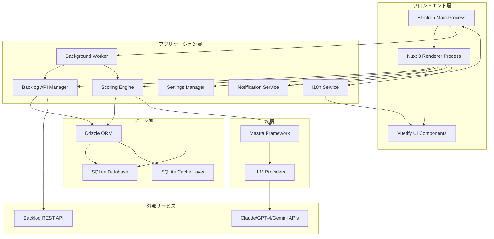
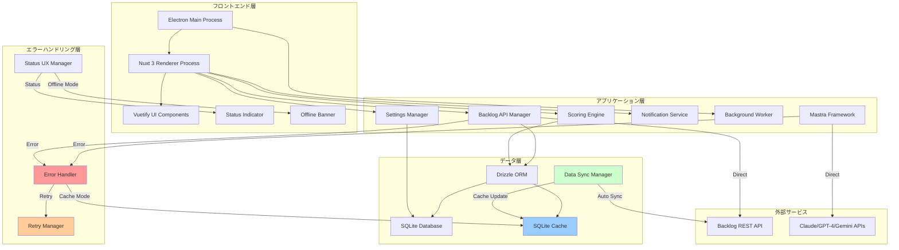
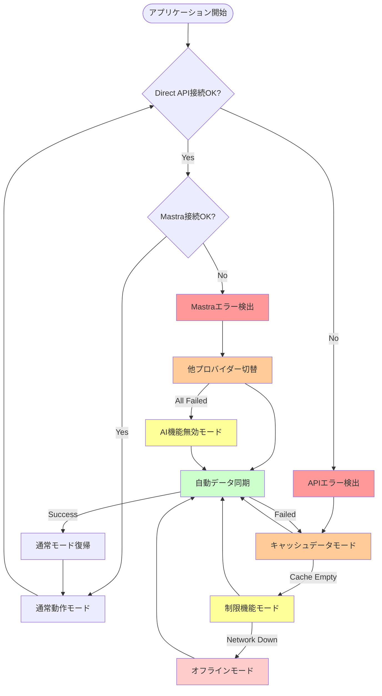
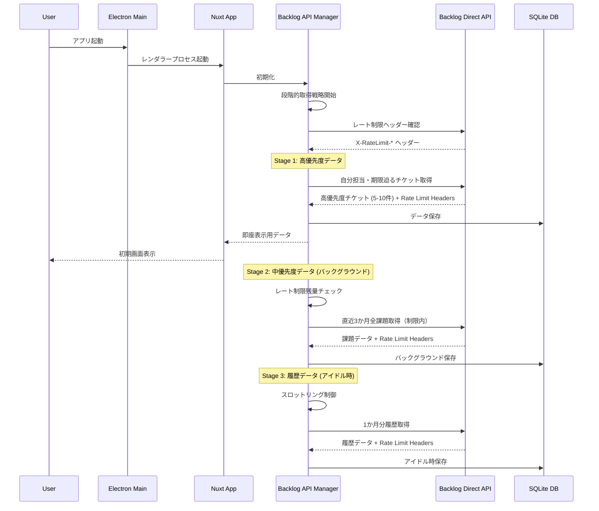
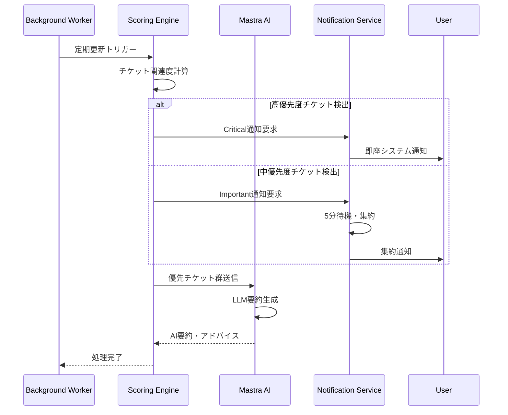
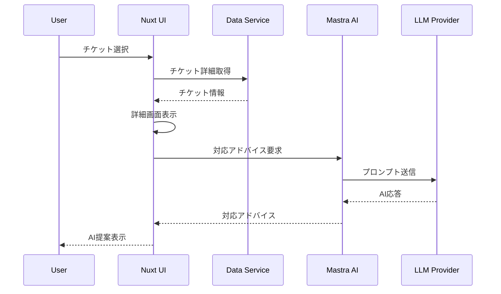

# 技術設計

## 概要

ProjectLensは、Backlog Direct APIで複数のBacklogスペースから関連度の高いチケットを自動抽出・表示・通知するデスクトップアプリケーションです。Electron + Nuxt 3 + Vuetifyの技術スタックを採用し、SQLiteキャッシュベースの冗長性とMastraフレームワーク経由でのLLM統合により、効率的なタスク管理と自動優先順位付けを実現します。シンプルなアーキテクチャで高いパフォーマンスとメンテナンシビリティを実現します。

## 要件マッピング

### 設計コンポーネントのトレーサビリティ

各設計コンポーネントが対応する要件:

- **BacklogAPIマネージャー** → REQ-1: Backlog連携・データ管理システム
- **スコアリングエンジン** → REQ-2: チケット関連度スコアリングシステム
- **通知システム** → REQ-3: 通知システム
- **Mastra AI統合** → REQ-4: LLM機能・AI要約アドバイス
- **Electron/Nuxt UIレイヤー** → REQ-5: ユーザーインターフェイス
- **設定管理モジュール** → REQ-6: 設定管理システム
- **バックグラウンドワーカー** → REQ-7: バックグラウンド処理・システム常駐
- **多言語化システム** → REQ-8: 日本語・英語対応の国際化機能

### ユーザーストーリーカバレッジ

- **複数Backlogスペース管理**: BacklogAPIマネージャーによるDirect API並列接続とデータ統合
- **関連度高いチケット把握**: スコアリングエンジンによる2段階優先度システム
- **適切なタイミング通知**: 通知システムによる優先度別通知戦略
- **AI要約とアドバイス**: Mastra統合によるLLM活用
- **直感的UI操作**: Electron + Nuxt 3 + Vuetifyによるデスクトップアプリ
- **柔軟な設定管理**: SQLite + 暗号化による安全な設定保存
- **継続的監視**: バックグラウンドワーカーによる定期更新
- **多言語対応**: Vue I18nによる日本語・英語の動的切り替え

## アーキテクチャ

### シンプルアーキテクチャ



### SQLiteキャッシュベース冗長性アーキテクチャ



### SQLiteキャッシュベース冗長性フロー



### 技術スタック

#### フロントエンド

- **Electron 33+**: クロスプラットフォームデスクトップアプリケーション
- **Nuxt 3.16+**: Vue 3ベースのフレームワーク、SSR無効設定
- **Vue 3.5+**: Composition APIによるリアクティブUI
- **Vuetify 3.8+**: Material Designコンポーネントライブラリ
- **TypeScript 5.7+**: 型安全性の確保
- **Pug**: HTMLテンプレートエンジン、簡潔な記法によるマークアップ効率化

#### バックエンド

- **Node.js 22+**: JavaScriptランタイム
- **axios**: HTTPクライアント（Backlog API接続）
- **Drizzle ORM**: TypeScript-firstの軽量ORM
- **better-sqlite3**: 高速同期SQLiteドライバー

#### ユーティリティ

- **Pino**: 構造化ログライブラリ
- **node-notifier**: クロスプラットフォーム通知
- **node-cron**: バッチ処理スケジューリング
- **@mastra/core**: AI Agentフレームワーク

#### 多言語化

- **Vue I18n**: Vue 3対応の国際化ライブラリ
- **@intlify/unplugin-vue-i18n**: Nuxt 3統合プラグイン
- **@nuxtjs/i18n**: Nuxt 3公式国際化モジュール

#### 開発・ビルド

- **electron-vite**: Electron専用Viteビルドツール、高速HMR対応
- **electron-builder**: アプリケーションパッケージング
- **@nuxtjs/pug**: Nuxt 3用Pugテンプレートエンジン統合モジュール
- **pug**: Pugコンパイラー本体、クリーンなHTMLテンプレート記述

### アーキテクチャ決定根拠

#### Electron + Nuxt 3選択理由

- **研究結果**: 2025年現在、electron-viteによる手動統合がもっとも安定している
- **開発効率**: electron-viteの高速HMRとViteによる最適化されたビルド
- **メンテナンス性**: Nuxtのモジュラーアーキテクチャとelectron-viteの柔軟な設定による拡張性
- **安定性**: nuxt-electronの非互換性問題を回避し、長期メンテナンス可能な構成

#### Vuetify選択理由

- **Material Design準拠**: 直感的で一貫性のあるUI
- **Treeshaking対応**: 使用コンポーネントのみバンドル
- **高いカスタマイズ性**: デザイントークンシステム
- **国際化対応**: 内蔵の多言語化機能とVue I18n連携

#### SQLite + Drizzle ORM選択理由

- **ローカルファースト**: ネットワーク依存なしの高速アクセス
- **TypeScript統合**: 完全な型安全性
- **キャッシュ戦略**: Drizzleの柔軟なキャッシュ機能
- **Electron互換性**: better-sqlite3による安定動作

#### Direct API Only選択理由

- **シンプルなアーキテクチャ**: 中間層なしの直接接続でデバッグとトラブルシューティングが簡素
- **高いパフォーマンス**: HTTP直接通信による低レイテンシと高速化
- **メンテナンシビリティ**: 標準的なREST APIによる長期サポートと安定性
- **軽量化**: 依存関係削減とバンドルサイズ減少

#### SQLiteキャッシュ冗長性理由

- **オフライン対応**: ネットワークエラー時のキャッシュデータでの継続動作
- **段階的デグラデーション**: エラー時の機能制限での安定動作
- **自動復旧**: 接続復帰時のデータ自動同期

#### Mastra選択理由

- **マルチLLM対応**: プロバイダー切り替えが容易
- **TypeScript native**: 型安全なAI統合

#### Vue I18n選択理由

- **Vue 3完全対応**: Composition API、TypeScriptとの完全統合
- **Nuxt 3公式サポート**: @nuxtjs/i18nモジュールによるシームレス統合
- **SSR対応**: サーバーサイドレンダリング環境での正確な言語検出
- **高パフォーマンス**: 遅延読み込み、コード分割対応

#### Pugテンプレートエンジン選択理由

- **記述効率**: インデントベースの簡潔な記法によるHTML記述量削減
- **可読性向上**: ネストレベルの視覚的明確化とタグクロージャーの省略
- **Vuetifyとの親和性**: コンポーネントベースUIライブラリとの組み合わせで威力を発揮
- **TypeScript統合**: Vue SFCとの完全統合とコンポーネントpropsの型安全性
- **メンテナンス性**: 一貫した記法による長期保守性の向上
- **Nuxt 3サポート**: @nuxtjs/pugモジュールによる公式サポートとHMR対応

## データフロー

### プライマリユーザーフロー

#### 1. 初回起動とデータ取得



#### 2. スコアリングと通知



#### 3. 個別チケット詳細表示



## コンポーネントとインターフェイス

### バックエンドサービス＆メソッドシグネチャ

#### BacklogAPIManager Service（シンプル化）

```typescript
class BacklogAPIManager {
  async initializeSpaces(configs: SpaceConfig[]): Promise<void>  // Direct API接続初期化
  async fetchHighPriorityIssues(spaceId: string): Promise<Issue[]>  // 高優先度チケット取得
  async fetchAllIssues(spaceId: string, since?: Date): Promise<Issue[]>  // 全チケット取得
  async fetchComments(issueId: string): Promise<Comment[]>  // コメント取得
  async getRateLimitStatus(spaceId: string): Promise<RateLimitInfo>  // レート制限状況取得

  // エラーハンドリング機能
  async handleAPIError(error: APIError): Promise<void>  // APIエラーハンドリング
  async enableCacheMode(): Promise<void>  // キャッシュモード有効化
  async syncWhenOnline(): Promise<void>  // オンライン時自動同期
  getConnectionStatus(): ConnectionStatus  // 接続状態取得
}

class BacklogDirectClient {
  constructor(config: DirectAPIConfig)
  async validate(): Promise<void>  // API接続検証
  async getIssues(projectId: string): Promise<{issues: Issue[], rateLimits: RateLimitInfo}>  // チケット取得
  async getComments(issueId: string): Promise<{comments: Comment[], rateLimits: RateLimitInfo}>  // コメント取得
  async updateIssue(issueId: string, data: Partial<Issue>): Promise<Issue>  // チケット更新
  getRateLimitHeaders(response: AxiosResponse): RateLimitInfo  // レート制限ヘッダー解析
  isOnline(): boolean  // オンライン状態チェック
}

class SQLiteCacheManager {
  async getCachedIssues(spaceId: string): Promise<Issue[]>  // キャッシュチケット取得
  async getCachedComments(issueId: string): Promise<Comment[]>  // キャッシュコメント取得
  async updateCache(data: CacheData): Promise<void>  // キャッシュ更新
  async syncPendingChanges(): Promise<void>  // 保留中変更の同期
  getCacheStatus(): CacheStatus  // キャッシュ状態取得
}
```

#### ScoringEngine Service

```typescript
class ScoringEngine {
  calculateScore(issue: Issue, context: UserContext): number  // スコア計算
  classifyPriority(score: number): Priority  // 優先度分類
  async analyzeComments(issue: Issue): Promise<CommentAnalysis>  // コメント分析
  async detectMentions(comments: Comment[]): Promise<Mention[]>  // メンション検出
  applyCustomWeights(config: ScoringConfig): void  // カスタム重み適用
}
```

#### NotificationService

```typescript
class NotificationService {
  async sendCriticalNotification(issues: Issue[]): Promise<void>  // 高優先度通知
  async queueImportantNotification(issues: Issue[]): Promise<void>  // 中優先度通知キュー
  async processBatchNotifications(): Promise<void>  // バッチ通知処理
  registerClickHandler(callback: () => void): void  // クリックハンドラー登録
}
```

#### MastraAIService（シンプル化）

```typescript
class MastraAIService {
  async generateSummary(issues: Issue[]): Promise<Summary>  // チケット群要約
  async generateAdvice(issue: Issue): Promise<Advice>  // 個別アドバイス
  async suggestNextActions(issue: Issue): Promise<Action[]>  // 次のアクション提案
  switchProvider(provider: LLMProvider): void  // プロバイダー切り替え

  // シンプルエラーハンドリング
  async handleProviderError(error: ProviderError): Promise<void>  // プロバイダーエラーハンドリング
  async fallbackToNextProvider(): Promise<boolean>  // 次のプロバイダーへフォールバック
  isAnyProviderAvailable(): boolean  // 利用可能プロバイダーの確認
  disableAIFeatures(): void  // AI機能の無効化
}

class SimpleAIFallback {
  generateBasicSummary(issues: Issue[]): Summary  // シンプルな統計情報要約
  generateBasicAdvice(issue: Issue): Advice  // テンプレートベースアドバイス
  getStatusMessage(): string  // AI機能の状態メッセージ
}
```

## データベース設計

### スキーマ概要

データベースには以下の主要テーブルを配置：

- **spaces**: Backlogスペース情報
- **issues**: チケット情報（スコアと優先度含む）
- **comments**: チケットコメント
- **mentions**: メンション情報
- **user_profiles**: ユーザー情報
- **ai_cache**: AI生成コンテンツキャッシュ
- **settings**: アプリ設定
- **notification_history**: 通知履歴
- **sync_status**: 同期状態管理

詳細なスキーマ定義は [`examples/database-schema.md`](./examples/database-schema.md) を参照。

## UI/UXデザインパターン

### コンポーネント設計

主要なUIコンポーネント：

- **IssueCard**: チケット表示カード（優先度表示、AI要約統合）
- **SettingsDialog**: 設定画面モーダル
- **LanguageSelector**: 言語切り替えUI
- **NotificationToast**: システム通知UI

実装例は [`examples/component-examples.md`](./examples/component-examples.md) を参照。

### Pugテンプレートベストプラクティス

- インデント統一（2スペース）
- Vuetifyコンポーネントとの組み合わせ
- 条件分岐とループの適切な使用
- TypeScript統合パターン

## フォールバック戦略

### レジリエンス設計

システム障害に対する多層防御戦略：

1. **健全性監視**: 継続的なサービス状態監視（Direct API優先）
2. **自動フォールバック**: キャッシュデータ、オフラインモード
3. **ローカルAI**: ルールベース要約、テンプレートアドバイス
4. **ユーザー通知**: 分かりやすい状態表示とガイダンス
5. **自動復旧**: 接続復旧時の自動正常化（Direct API復帰優先）

実装詳細は [`examples/fallback-implementation.md`](./examples/fallback-implementation.md) を参照。

## 多言語化システム

### アーキテクチャ

- **Vue I18n**: 標準的な実装パターン
- **システム言語検出**: OS言語の自動検出
- **設定永続化**: ユーザー選択の保存
- **動的切り替え**: リアルタイム言語変更

設定例と実装パターンは [`examples/i18n-examples.md`](./examples/i18n-examples.md) を参照。

## パフォーマンス＆スケーラビリティ

### パフォーマンスターゲット

| メトリクス | 目標値 | 測定方法 |
|----------|--------|---------|
| 初回起動時間 | < 3秒 | アプリ起動から初期画面表示 |
| 初期データ表示 | < 5秒 | 高優先度チケット表示 |
| API応答時間 (p95) | < 200ms | ローカルAPI呼び出し |
| DB クエリ (p99) | < 50ms | SQLiteクエリ実行時間 |
| メモリ使用量 | < 500MB | 通常使用時のRAM消費 |
| 同時スペース数 | > 10 | 並列Direct API接続数 |

### キャッシング戦略

- **Hot Cache**: 頻繁アクセス（メモリ）
- **Warm Cache**: 中頻度アクセス（SQLite）
- **Cold Cache**: 低頻度アクセス（ディスク）

### スケーラビリティアプローチ

- **並列処理**: スペース毎の独立取得
- **レート制限対応**: 150req/分 per space
- **バックグラウンド処理最適化**: Web Worker活用、優先度キュー

## テスト戦略

### テストカバレッジ要件

- **ユニットテスト**: ≥80% コードカバレッジ
- **統合テスト**: 全APIエンドポイントとデータフロー
- **E2Eテスト**: クリティカルユーザージャーニー
- **パフォーマンステスト**: 期待ピークの2倍負荷

### テストツール

- **テストランナー**: Vitest
- **E2Eテスト**: Playwright
- **モック**: MSW (Mock Service Worker)
- **カバレッジ**: c8
- **パフォーマンス**: Lighthouse CI

## エラーハンドリング

### エラー分類と処理戦略

- **CRITICAL**: アプリ停止レベル → ログ記録・通知・グレースフルシャットダウン
- **ERROR**: 機能停止レベル → ログ記録・リトライ・フォールバック処理
- **WARNING**: 部分的影響 → ログ記録・代替処理続行

### リトライ戦略

- **API通信エラー**: 指数バックオフ（最大3回）
- **データベースロック**: 即座リトライ（最大5回）
- **ネットワークエラー**: エクスポネンシャルバックオフ（最大3回）

## 実装例・設定例

詳細な実装例は以下のファイルを参照：

- [`examples/component-examples.md`](./examples/component-examples.md) - UIコンポーネント実装例
- [`examples/fallback-implementation.md`](./examples/fallback-implementation.md) - フォールバック戦略実装
- [`examples/i18n-examples.md`](./examples/i18n-examples.md) - 多言語化設定・実装例
- [`examples/project-config.md`](./examples/project-config.md) - プロジェクト設定・ビルド設定
- [`examples/database-schema.md`](./examples/database-schema.md) - データベーススキーマ・接続設定

## 開発・運用ガイドライン

### 開発ワークフロー

1. **機能設計**: 要件とのトレーサビリティ確認
2. **実装**: TypeScriptストリクトモード、テスト駆動開発
3. **テスト**: ユニット・統合・E2E テストの実施
4. **ビルド**: クロスプラットフォームビルドの検証
5. **デプロイ**: 段階的リリースと監視

### コード品質基準

- TypeScript strict mode有効
- ESLint + Prettier設定準拠
- テストカバレッジ80%以上
- パフォーマンス基準達成
- アクセシビリティ WCAG 2.1 AA準拠

### セキュリティ要件

- APIキーの暗号化保存
- ローカルデータベースの保護
- 外部通信の安全性確保
- セキュリティアップデートの定期適用
