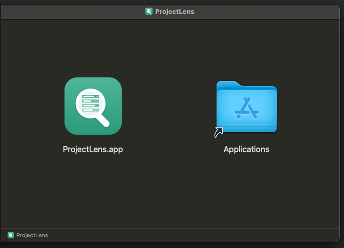
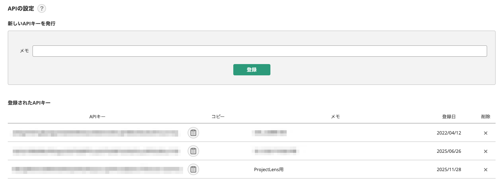
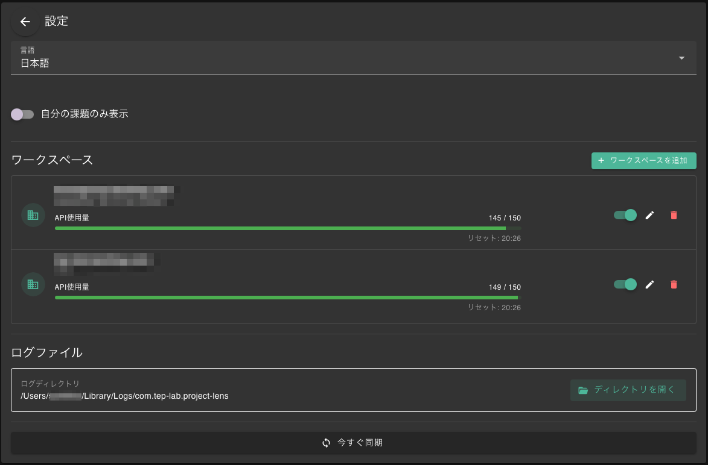
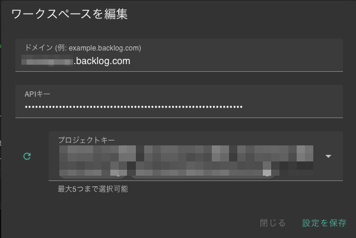

# ProjectLens セットアップガイド

このドキュメントでは、ProjectLens のインストールから初期設定までの手順を説明します。

## 1. アプリケーションのインストール

### macOS の場合

1. 配布された `ProjectLens-x.x.x-macOS.dmg` ファイルをダブルクリックして開きます。
2. ProjectLens アイコンを Applications フォルダにドラッグ＆ドロップします。
3. Applications フォルダから ProjectLens を起動します。

### Windows の場合（準備中）

_**Windows版は準備中です。**_

1. 配布された `ProjectLens_x.x.x_x64-setup.exe` を実行します。
2. インストーラーの指示に従ってインストールを完了させます。

## 2. Backlog API キーの取得

ProjectLens を使用するには、あなたの Backlog アカウントの API キーが必要です。以下の手順で取得してください。

1. ブラウザで Backlog にログインします。
2. 画面右上のユーザーアイコンをクリックし、「個人設定」を選択します。
3. 左側のメニューから「API」をクリックします。
4. 「新しいAPIキーを発行」セクションで以下の情報を入力します：
    - **メモ**: `ProjectLens` など、用途がわかる名前を入力
5. 「登録」ボタンをクリックします。
6. 発行された「APIキー」をコピーし、安全な場所に控えておきます。

## 3. アプリケーションの初期設定

アプリを初めて起動すると、設定画面（またはダッシュボード）が表示されます。同期を開始するために以下の設定を行ってください。

1. アプリ画面右上の設定アイコン（⚙️）をクリックして設定画面を開きます。
2. ワークスペース欄の「ワークスペースを追加」ボタンをクリックします。
3. ワークスペース編集画面で以下の項目を入力します：
    - **ドメイン**: あなたの Backlog のドメイン（例: `your-company.backlog.jp` や `your-company.backlog.com`）
    - **APIキー**: 手順2で取得した API キーを貼り付けます
4. 「更新」ボタンをクリックして、接続を確認します。
5. 接続が成功すると、プロジェクトを選択するリストが表示されます。
6. ProjectLens で表示したいプロジェクト（最大5つまで）にチェックを入れます。
7. 「設定を保存」ボタンをクリックして設定を保存します。
8. 設定画面の「今すぐ同期」ボタンをクリックして、同期を開始します。

## 4. 設定完了

同期が完了すると、ダッシュボードや課題一覧に課題が表示されます。

これでセットアップは完了です！
アプリの詳しい使い方は [利用方法ドキュメント](USER_MANUAL.md) をご覧ください。
