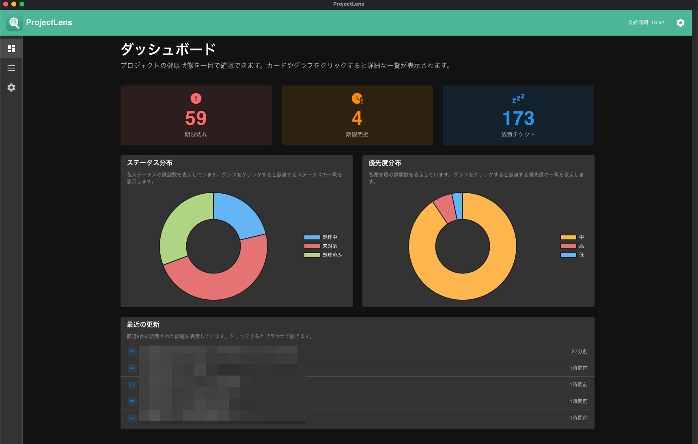
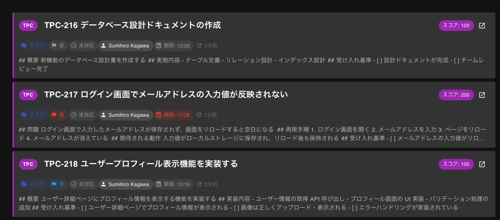
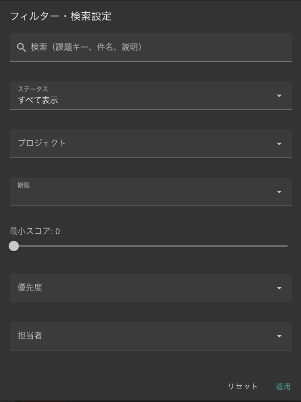
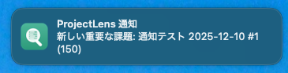

# ProjectLens ユーザーマニュアル

ProjectLens は、Backlog の課題をスマートに管理するためのデスクトップアプリケーションです。
複数の Backlog ワークスペース、プロジェクトに渡って課題を一覧表示し、優先順位を自動的に計算して表示します。
このマニュアルでは、日々の業務での ProjectLens の活用方法を解説します。

## 1. 主な機能

- **スマートスコアリング**: 優先度、期限、担当者などの情報から、あなたにとって「今」重要な課題を自動で計算・表示します。
- **マルチワークスペース**: 最大5つの Backlog ワークスペースの課題を一つの画面で横断的に確認できます。
- **マルチプロジェクト**: 最大5つのプロジェクトの課題を一つの画面で横断的に確認できます。
- **クイックアクセス**: ワンクリックで Backlog の課題詳細ページをブラウザで開けます。
- **通知機能**: 重要な課題が発生した際にデスクトップ通知でお知らせします。

## 2. ダッシュボード

アプリを起動すると表示されるメイン画面がダッシュボードです。
ここでは、期限切れや期限近い課題数などがカード形式で表示されます。

### ダッシュボードの見方

- **期限切れカード**: 期限を過ぎている課題数
- **期限間近カード**: 期限が近い（3日以内に期限が迫っている）課題数
- **放置チケットカード**: 5日以上更新がない未完了の課題数
- **ステータス分布カード**: 未対応、処理中、処理済みの割合をドーナツチャートで表示
- **優先度分布カード**: 高、中、低の割合をドーナツチャートで表示
- **最近の更新課題一覧**: 最近更新された課題を一覧表示（課題タイトルをクリックするとブラウザでBacklogの課題ページを開きます）

※各カードをクリックすると、課題一覧画面でフィルタリングされた状態で表示されます

## 3. 課題一覧

課題一覧では、対象としたワークスペース、プロジェクトの課題を一覧表示します。

### 課題レコードの構成

各レコードには以下の情報が表示されています。

- **スコア（課題レコード左端の円）**: AIが計算した重要度（0〜150点）。数字が大きいほど優先度が高いことを示します。赤色は特に重要（80点以上）な課題です。
- **プロジェクトリボン**: 課題レコード左端の色付きバーはプロジェクトを表しています。
- **課題キーとタイトル**: クリックするとブラウザで Backlog の課題ページを開きます。
- **ステータス・優先度**: Backlog 課題のステータスと優先度が表示されます。
- **担当者**: Backlog 課題の担当者が表示されます。
- **期限日**: 期限が近い、または切れている場合は強調表示されます。
- **更新日**: Backlog 課題の相対的な更新日（例：5時間前、1日前など）が表示されます。

## 4. 課題のフィルタリングと検索

画面上部のバーを使って、表示する課題を絞り込むことができます。

### フィルタリング機能
以下の条件で課題を絞り込めます。アイコンをクリックするとフィルターが適用されます。

- **ステータス**: 「すべて」「未対応」「処理中」などを切り替え。
- **期限**:
    - **今日**: 今日期限の課題のみ表示
    - **今週**: 今週が期限の課題を表示
    - **期限切れ**: 期限を過ぎている課題を表示
- **自分の担当**: 自分が担当者になっている課題のみを表示します。

### 検索機能
右上の検索ボックスにキーワードを入力すると、タイトルや課題キーでリアルタイムに検索できます。

## 4. 並び替え（ソート）

デフォルトでは「関連度スコア」順に並んでいますが、ソートボタンで並び順を変更できます。

- **スコア順**: 重要度が高い順（デフォルト）
- **期限日順**: 期限が近い順
- **優先度順**: Backlogの設定優先度が高い順（高 -> 中 -> 低）
- **更新日順**: 最近更新された順

## 5. 通知について

ProjectLens はバックグラウンドで定期的に課題を同期しています。
スコアが **80点以上** の重要な課題が新たに検出されると、デスクトップ通知が表示されます。通知をクリックすると、ProjectLens アプリが開きます。

## 6. 設定の変更

監視するプロジェクトを変更したり、APIキーを更新したい場合は、サイドメニューの「設定」メニュもしくは、画面右上の設定アイコン（⚙️）をクリックしてください。

## 7. スコアリング基準

ProjectLens は以下の基準で各課題のスコア（関連度）を計算しています。

| 項目 | 条件 | 点数 | 備考 |
|---|---|---|---|
| **担当者** | 自分が担当者に設定されている | **+50点** | 基本スコア |
| **期限** | 期限を過ぎている | **+100点** | 自分が担当の場合のみ加算 |
| | 期限まで7日以内 | **+50点** | 自分が担当の場合のみ加算（期限切れとは重複しません） |
| **更新** | 3日以内に更新があった | **+50点** | 自分が担当の場合のみ加算 |
| **メンション** | 説明文に自分の名前が含まれている | **+30点** | 担当者でなくても加算されます |

**計算例：**
- 自分が担当（+50）
- 期限が明日、つまり7日以内（+50）
- 昨日更新された（+50）
- **合計：150点**

以上で基本的な使い方の説明は終了です。
